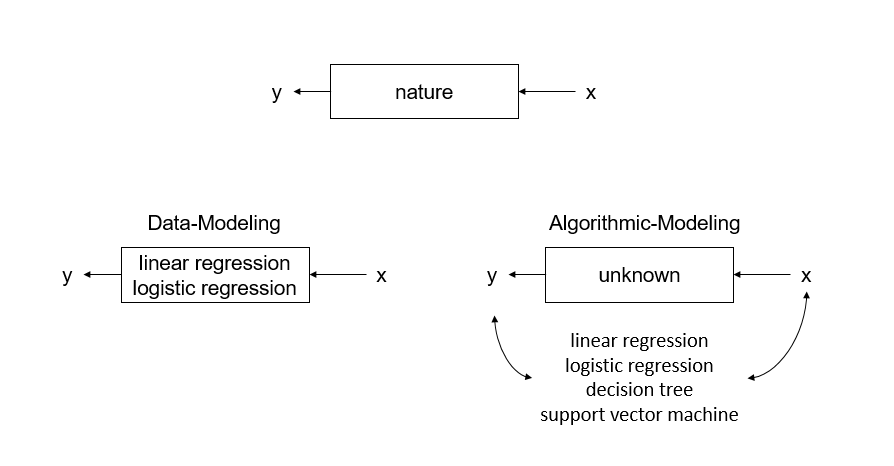

# Machine Learning Overview {#ml-overview}

## What is Machine Learning?

In simple terms, machine learning is a statistical modeling technique that focuses on algorithmic-driven models instead of data-driven models. Figure \@ref(fig:model-compare) shows a comparison of these two approaches and is an adaptation of a figure in this [article](https://projecteuclid.org/euclid.ss/1009213726) by @breiman2001statistical. 

```{r model-compare, echo=FALSE,fig.asp=.7, fig.width=6, fig.cap='A statistical model comparison.', fig.align='center', out.width='90%'}

```

The model at the top illustrates the original problem to be solved; which is how to best represent the relationship between a vector in input variables $x$ and a corresponding response variable $y$? The data-modeling approach in the lower left assumes that a stochastic data model represents this relationship [@breiman2001statistical]. The analyst using this method will then estimate the parameters of the model and validate the model using goodness of fit tests. Thus, a general function representing this approach would be

$$\text{response variables} = f(\text{predictor variables, random noise, parameters})$$

In comparison to the data-modeling approach, the analytic-modeling approach doesn't make any assumptions about the relationship between $x$ and $y$. Instead, the focus is on finding a function $f(x)$ that will input a variable $x$ to predict a value for $y$ and is the model in the lower right of Figure \@ref(fig:model-compare). 

## What machine learning is not

While machine learning has made significant breakthroughs in many areas (web search, image recognition, game AI, medical diagnosis, prediction, and classification to name a few), it is a technique that is not without limitations.For this course, we will cover a few of these limitations, but you can read a more in-depth critical analysis presented by @marcus2018deep. 

### Machine learning models require a lot of data {-}
For machine learning algorithms to learn well, they need lots of data. A review of the types of [use cases](https://www.dezyre.com/article/top-10-industrial-applications-of-machine-learning/364) that these models have achieved a lot of success will give you an appreciation for the amount of data needed to train, validate, and use these models into a production environment.

### Machine learning models are not a substitute for domain expertise {-}
When appropriately used, machine learning models can help us to find hidden patterns in our data that are not possible on our own. While this is a great benefit, it does not alleviate the burden of understanding what these results mean, and whether they even matter when it comes to finding an adequate solution to a business problem. 


### Machine learning models require constant maintenance {-}
This statement should not come as a surprise since machine learning models are an extension of statistics in some ways. In general machine learning problems work best with applications that are similar to their training context. Even then, [mistakes](https://gizmodo.com/british-cops-want-to-use-ai-to-spot-porn-but-it-keeps-m-1821384511) can happen, and the modeler must make adjustments.

## What do I need to know to get started with machine learning?

Once you are familiar with the concepts in machine learning, you will realize that most of the ideas are similar to other statistical methods. The key here is learning the following thoughts.

### The role of data in machine learning {-}

Machine learning algorithms primarily use tabular data. Nevertheless, machine learning literature has its origin in computer science, and some of the terms used to describe data are slightly different than traditional statistics. Primarily, the regressor variables in machine learning are called features. Features are used to make predictions on target or outcome measures. 

### The difference between parametric and nonparametric machine learning algorithms {-}

#### Parametric Models {-}
Parametric machine learning models are based on modeling assumptions about the mapping of the feature variables to the target variable. Some examples of parametric machine learning models are Linear Regression, Logistic Regression, and Linear Discriminant Analysis. In general parametric models are simpler, faster to compute, and require fewer data. A key drawback, however, is that parametric models are rigid and do not adjust well to variations in the data [@brownlee2017mlmastery]. 

#### Nonparametric Models {-}

Nonparametric machine learning models are not based on any modeling assumptions about the mapping of the feature variables to the target variable. Some examples of nonparametric models are $k$-Nearest Neighbors, Na{\i}ve Bayes, Support Vector Machines, Neural Networks, and Decision Trees. In general nonparametric models more complex, slower to compute, and require more data than parametric models. A principal drawback of nonparametric models, however, is their inconsistent results [@brownlee2017mlmastery]. 

### The difference between supervised, unsupervised and semi-supervised learning {-}

The key takeaway here is that supervised learning models predict a value; unsupervised learning models describe associations and patterns in a dataset, and semi-supervised learning models are combinations of the two [@friedman2001elements].Furthermore, supervised learning involves data that has labeled features and target variables. In contrast, unsupervised learning uses data that does not have any feature or target variable labels. 

### The bias-variance tradeoff {-}

The company EliteDataScience created an [infographic](https://elitedatascience.com/bias-variance-tradeoff) that provides a vivid explanation of the importance of the bias-variance tradeoff. The key to this concept is to understand that bias is the degree to which the predictions or classifications are different from the actual value. Parametric models tend to have higher bias than nonparametric models. Conversely, variance refers to how sensitive the model is to noise in the data. For variance error, nonparametric models will tend to be more sensitive to different sets of training data than parametric models. 

Another critical aspect is that bias and variance have an inverse relationship. In other words, models that usually have a high bias also have low variance. By contrast, models that have low bias will usually exhibit high variance. Hence, it is essential that you tune your modeling parameters and try as many different models as possible to evaluate model performance. 

### Overfitting and underfitting and what to do about it {-}

For underfitted models, the answer is simple; don't use the model. Overfitting, however, is a different problem. In this case, the model fits the data too well to apply for any general setting. Thus, you will have to spend some time making adjustments to the model and determining how best to engineer the features to reduce the risk of overfitting. 


