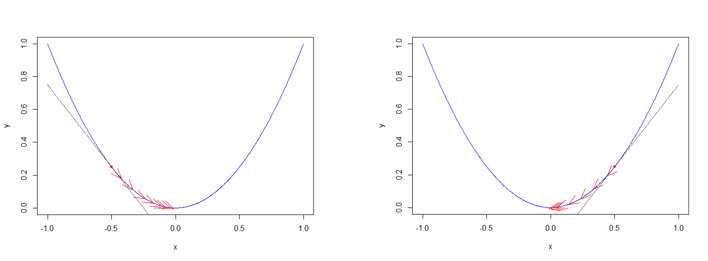
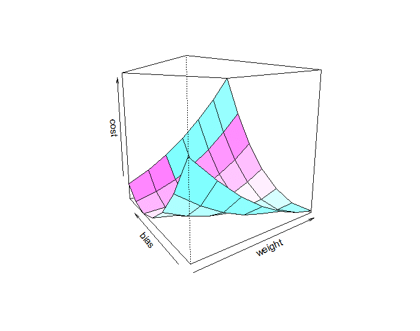
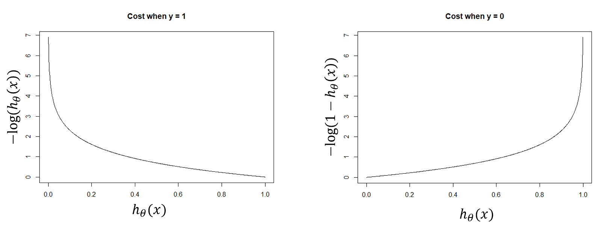
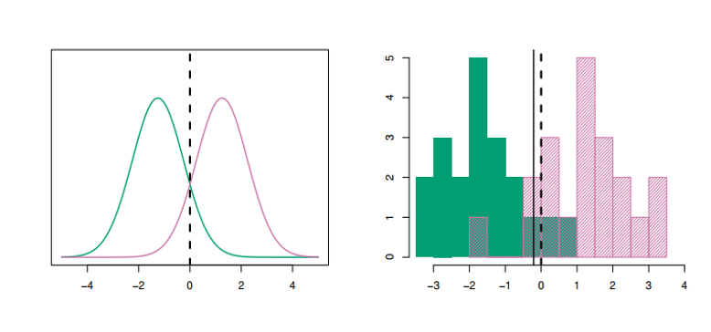

# Linear Algorithms {#lin-algs}


## Gradient Descent

One of the most common concepts for all machine learning algorithms is optimization. Of the many optimization methods, the most widely used optimization method in machine learning is gradient descent. This extensive use of gradient descent is because gradient descent is straightforward to learn and compatible with any machine learning algorithm. For this section, we will use gradient descent with linear and logistic regression. 


### Linear Regression Model {-}

Before discussing the gradient descent algorithm, let's review the linear regression. Recall the general linear regression equation is:

$$
y\ =\ h\left(x\right)\ =\ \sum_{i=1}^Nw_ix_i\ +\ b\ +\ \epsilon
$$


where $y$ is the target variable, $x$ is the feature variables, $w_i$ are the weights of the $i$th feature variable, $b$ is the bias, and $\epsilon$ is the irreducible error. We use machine learning algorithms to estimate the bias and the weights of the feature variables. 

### Cost Function {-}

#### Simple Linear Regression {-}

In order to optimize the weight and the bias variable, we need to optimize the cost (loss) function. For linear regression this function, $J\left(w,b\right)$ is the Mean Squared Error (MSE) and we can calculate it by:

$$
MSE\ =\ J\left(w,b\right)\ =\ \frac{1}{m}\sum_{i=1}^m\left(y_i-\left(wx_i+b\right)\right)^2
$$
Since we are adjusting the cost function by the weight and the bias parameters, we must take the partial derivative with respect to each of these to calculate the gradient.

$$
J'\left(w,b\right)\ =
\begin{bmatrix}
\frac{\partial J}{\partial w}\\
\frac{\partial J}{\partial b}
\end{bmatrix}
=
\begin{bmatrix}
\frac{1}{m}\sum-2\cdot x_i\left(y_i-\left(wx_i+b\right)\right)\ =\ \delta_w\\
\frac{1}{m}\sum_{ }^{ }-2\cdot\left(y_i-\left(wx_i+b\right)\right)\ =\ \delta_b
\end{bmatrix}
$$

#### Multiple Linear Regression {-}

For multiple linear regression, we introduce a parameter matrix $\theta$ that contains the bias and weight parameters where:

$$
\begin{align}
h_{\theta}\left(x\right) &=\theta_0\ +\ \theta_1x_1\ +\ \dots\ +\ \theta_nx_n\\
h\left(x\right)\ &=\ \sum_{i=0}^n\theta_ix_i\ =\ \theta^Tx
\end{align}
$$

The cost function is:

$$
J\left(\theta\right)\ =\ \frac{1}{2m}\sum_{i=1}^m\left(h_{\theta}(x^{\left(i\right)})-y^{\left(i\right)}\right)^2
$$

In matrix form, the cost function becomes

$$
J\left(\theta\right)\ =\ \frac{1}{2m}\left(X\theta\ -\ y\right)^T\left(X\theta-y\right)
$$
where $X$ is a $m\ \times\ n$ design matrix, $\theta$ is a $n\ \times\ 1$ parameter matrix and $y$ is a $m\ \times\ 1$ vector of observed targets.

Taking the derivative with respect to $\theta$ yields:

$$
J'\left(\theta\right)\ =\ \frac{1}{m}X^T\left(X\theta-y\right)
$$

See the video below for an example derivation of the derivative of the cost matrix:

<iframe width="560" height="315" src="https://www.youtube.com/embed/tGkMr57ZvAk" frameborder="0" allow="autoplay; encrypted-media" allowfullscreen></iframe>

### Logistic Regression {-}

Another application of the gradient descent algorithm is for logistic regression. Recall that we use logistic regression when the target variable is categorical, and there are only two possible classifications. We show the general equation as

$$
h_{\theta}\left(x\right)\ =\ g\left(\theta^Tx\right)\ =\ \frac{1}{1+e^{-\theta^Tx}}
$$

and

$$
g\left(z\right)\ =\ \frac{1}{1+e^{-z}}
$$
The above equation is called a sigmoid or logistic function. Essentially, we first perform a linear regression on the weights and bias and then feed that predicted value into the sigmoid function to map a real value between 0 and 1. 

```{r, sigmoid}
sigmoid <- function(z){
  res <- 1 / (1 + exp(-z))
  res
}
```

```{r sigmoid-plot, echo=FALSE,fig.asp=.7, fig.width=6, fig.cap='Example Sigmoid function plot.', fig.align='center', out.width='90%'}
x <- seq(-5,5,length.out = 1000)
y <- sigmoid(x)
plot(x,y, xlab = "x", ylab = "sigmoid(x)",type="l")
abline(h = 0.5,lty=2)
```

The cost function for logistic regression will differ now, that the function  we are analyzing is non-linear. First let's assume the following:

$$
\begin{align}
P\left(y\ =\ 1|x;\theta\right)\ &=\ h_{\theta}\left(x\right)\\
P\left(y\ =\ 0\ |x;\theta\right)\ &=\ 1-h_{\theta}\left(x\right)\\
P\left(y|x;\theta\right)\ &=\ \left(h_{\theta}\left(x\right)\right)^y\left(1-h_{\theta}\left(x\right)\right)^{1-y}
\end{align}
$$
We now can find the log cross-entropy cost by:

$$
J\left(\theta\right)\ =\ -\frac{1}{m}\sum_{i=0}^m\left[y^{\left(i\right)}\log\left(h_{\theta}(x^{\left(i\right)})\right)\ +\ \left(1-y^{\left(i\right)}\right)\log\left(1-h_{\theta}(x^{\left(i\right)})\right)\right]
$$
where $h_\theta(x)$ is the sigmoid function. 

When taking the derivative with respect to $\theta$, recall that $g'\left(z\right)\ =\ g\left(z\right)\left(1-g\left(z\right)\right)$. Thus,

$$
\begin{align}
J'\left(\theta\right)\ &=\ \frac{\partial}{\partial J}-\frac{1}{m}\sum_{i=0}^m\left[y^{\left(i\right)}\log\left(h_{\theta}(x^{\left(i\right)})\right)\ +\ \left(1-y^{\left(i\right)}\right)\log\left(1-h_{\theta}(x^{\left(i\right)})\right)\right]\\
&=-\frac{1}{m}\left(y\frac{1}{g\left(\theta^Tx\right)}-\left(1-y\right)\frac{1}{1-g\left(\theta^Tx\right)}\right)\frac{\partial}{\partial\theta_j}g\left(\theta^Tx\right)\\
&=-\frac{1}{m}\left(y\frac{1}{g\left(\theta^Tx\right)}-\left(1-y\right)\frac{1}{1-g\left(\theta^Tx\right)}\right)g\left(\theta^Tx\right)\left(1-g\left(\theta^Tx\right)\right)\frac{\partial}{\partial\theta_j}\theta^Tx\\
&=-\frac{1}{m}\left(y\left(1-g\left(\theta^Tx\right)\right)-\left(1-y\right)g\left(\theta^Tx\right)\right)x_j\\
&=-\frac{1}{m}\left(y-g\left(\theta^Tx\right)\right)x_j\\
&=\frac{1}{m}\left(h_{\theta}\left(x\right)-y\right)x_j\\
\end{align}
$$

What is interesting to note is that this gradient function looks precisely like the gradient function for linear regression. The difference, however, is that the function $h_\theta(x)$ is a sigmoid function and not a linear function of the weights and bias parameters. For further details of the above derivations see @ng2000cs229 and @fortuner2017mlcheat.

### Gradient Descent Algorithm {-}

Finally, to solve for the optimal weight and bias, we will add a learning parameter, $\alpha$, to adjust the steps of the gradient. 

#### Simple Linear Regression {-}

The algorithm we will use is:

$$
\text{Repeat until convergence } \{\\
w\ :=\ w-\alpha\delta_w\\
b\ :=\ b\ -\ \alpha\delta_b\\
\}
$$

#### Multiple Linear Regression {-}

For multiple linear regression the algorithm changes to:

$$
\text{Repat until convergence } \{\\
\theta_j\ :=\ \theta_j-\alpha\frac{1}{m}\sum_{i=1}^m\left(h_{\theta}(x^{\left(i\right)})-y^{\left(i\right)}\right)x_j^{\left(i\right)}\\
\}
$$

In this algorithm we are simultaneously updating the weights, $\theta_j$, for all $j\ \in\left(0,\dots,n\right)$. Recall that $\theta_0$ is the bias term and $x_0^1\ =\ 1$.

In matrix form, our algorithm will look like this:

$$
\text{Repat until convergence } \{\\
\delta=\ \frac{1}{m}X^T\left(X\theta-y\right)\\
\theta:=\ \theta-\alpha\delta\\
\}
$$

#### Logistic Regression {-}
The matrix form of the stochastic gradient descent algorithm has the form:

$$
\text{Repat until convergence } \{\\
\delta=\ \frac{1}{m}X^T\left(sigmoid\left(X\theta\right)-y\right)\\
\theta:=\ \theta-\alpha\delta\\
\}
$$

### Gradient Descent Intuition {-}


Figure \@ref(fig:grad-descent-intuition) demonstrates the basic intuition behind the gradient algorithm. Fundamentally, if we pick a point along the graph of the cost function, and the gradient is negative, the algorithm will update by moving the more to the right. Conversely, if the gradient is positive, the algorithm will move the cost value more to the left. 

```{r grad-descent-intuition, echo=FALSE,fig.asp=.7, fig.width=6, fig.cap='A simple example of gradient descent.', fig.align='center', out.width='90%'}

```


Figure \@ref(fig:surface-plot) is a multi-dimensional view of the cost function, and the underlying concept is still the same.

```{r surface-plot, echo=FALSE,fig.asp=.7, fig.width=6, fig.cap='A surface plot of a quadratic cost function.', fig.align='center', out.width='90%'}

```

Figure \@ref(fig:log-entropy) is a plot of the log-entropy function for logistic regression.

```{r log-entropy, echo=FALSE,fig.asp=.7, fig.width=6, fig.cap='A simple example of gradient descent.', fig.align='center', out.width='90%'}

```

While the ideal cost function to minimize would be a convex function, this is not always practical and there are ways to deal with that as discussed in the following video.

<iframe width="560" height="315" src="https://www.youtube.com/embed/8zdo6cnCW2w" frameborder="0" allow="autoplay; encrypted-media" allowfullscreen></iframe>

## Practical Exercises

This practical exercieses are based on code provided by @fortuner2017mlcheat and @brownlee2017mlmastery.

### Simple Linear Regression

#### Data {-}
Suppose we have the following dataset in which we have a unique Company ID, radio advertising expenses in dollars, and annual sales as a result of those expenses in dollars. 

```{r, data}
data <- read.csv("data/Advertising-Radio.csv",header=TRUE)
head(data)
```

A view of the data shows that there appears to be a positive correlation between radio advertising spending and sales. 

```{r, sales-plot}
plot(data$radio,data$sales,xlab= "Radio", ylab = "Sales", col="dodgerblue",pch=20)
```

#### Making Predictions {-}
For this model, we want to predict sales based on the amount spent for radio advertising. Thus our formula will be

$$\text{Sales} = \text{Weight} \times \text{Radio} + \text{Bias}$$

The gradient descent algorithm will attempt to learn the optimal values for the Weight and Bias.

#### Simple Regression Function {-}
```{r,simple-regress}
simple_regress <- function(features,weight,bias){
  return(weight*features + bias)
}
```

#### Cost function Code {-}

```{r, cost-function}
cost_function <- function(features,targets,weight,bias){
  num_items <- length(targets)
  total_error <- 0
  for(i in seq_along(1:num_items)){
    total_error <- total_error + (targets[i] - (weight * features[i] + bias))^2
  }
  return(total_error/num_items)
}
```


#### Gradient Descent Code {-}


```{r, weight-update}
update_weight <- function(features,targets,weight,bias,learning_rate){
  delta_weight <- 0
  delta_bias <- 0
  num_items <- length(targets)
  
  for(i in seq_along(1:num_items)){
    #Calculate gradients
    error <- (targets[i] - (weight * features[i] + bias))
    delta_weight <- delta_weight + -2 * features[i] *  error
    delta_bias <- delta_bias + -2 * error

  }
  
  weight <- weight - learning_rate * (delta_weight/num_items)
  bias <- bias - learning_rate * (delta_bias/num_items)
  

  
  res <- c(weight,bias)
  res
}
```

#### Training the model {-}

We are now ready to train the final model. To do this we will iterate over a set number of trials and update the weight and bias parameters at each iteration. We will also track the cost history.

```{r,train-simple-model}
train <- function(features,targets,weight,bias,learning_rate,iters){
  cost_history <- numeric(iters)
  coef_history <- list()
  
  for(i in seq_along(1:iters)){
    tmp_coef <- update_weight(features,targets,weight,bias,learning_rate)
    weight <- tmp_coef[1]
    bias <- tmp_coef[2]
    coef_history[[i]] <- c(bias,weight)
    cost <- cost_function(features,targets,weight = weight, bias = bias)
    cost_history[i] <- cost
    
    if(i == 1 | i %% 10 == 0){
       cat("iter: ", i, "weight: ", weight, "bias: ", bias, "cost: ", cost, "\n")
    }
   
  }
  res <- list(Weight = weight, Bias = bias, Cost = cost_history,Coefs = coef_history)
  res
}

fit <- train(features = data$radio,targets = data$sales,weight = 0.03, bias = 0.0014, learning_rate = 0.001,iters = 30)
```


The plot below shows how the ``train()`` funtion iterated through the coefficient history.

```{r,final-plot}
plot(data$radio,data$sales,xlab= "Radio", ylab = "Sales", col="dodgerblue",pch=20,main="Final Plot With Coefficient History")
for(i in 1:30){
  abline(coef=fit$Coefs[[i]], col = rgb(0.8,0,0,0.3))
}
abline(coef = c(fit$Bias,fit$Weight),col="red")
```

This is a plot of the cost history.
```{r, cost-plot}
plot(fit$Cost,type="l",col="blue", xlab = "Iteration",ylab="Cost",main = "Error Rate Per Iteration")
```

#### Exercises {-}
1. Run the command `` res <- lm(data$sales ~ data$radio)`` and note the values for the weight and bias.
2. Plot the fitted line from ``res`` with the data and comapre that line to the trained model.
3. Adjust the fit object to obtain an estimate close to the noted parameters.

### Multiple Linear Regression

For this exercise, we will predict total sales based on TV, Radio, and Newspaper advertising costs.

#### Data {-}

```{r,multi-data}
multi_data <- read.csv("data/Advertising.csv", header = TRUE)
head(multi_data)
```

Since we are now dealing with multiple variables, we will need to view a pairs plot

```{r, pairs}
# Code for panel.cor found at https://www.r-bloggers.com/scatter-plot-matrices-in-r/

panel.cor <- function(x, y, digits = 2, cex.cor, ...)
{
  usr <- par("usr"); on.exit(par(usr))
  par(usr = c(0, 1, 0, 1))
  # correlation coefficient
  r <- cor(x, y)
  txt <- format(c(r, 0.123456789), digits = digits)[1]
  txt <- paste("r= ", txt, sep = "")
  text(0.5, 0.6, txt)

  # p-value calculation
  p <- cor.test(x, y)$p.value
  txt2 <- format(c(p, 0.123456789), digits = digits)[1]
  txt2 <- paste("p= ", txt2, sep = "")
  if(p<0.01) txt2 <- paste("p= ", "<0.01", sep = "")
  text(0.5, 0.4, txt2)
}

pairs(multi_data[,2:5],lower.panel = panel.smooth, upper.panel = panel.cor)
```

#### Cost Function Code

```{r,multi-cost}
multi_cost <- function(features,target,theta){
  sum((features %*% theta - target)^2) / (2*length(target))
}
```

#### Training Function Code {-}

```{r,multi-train}
multi_train <- function(features,target,theta,learn_rate,iters){
  cost_history <- double(iters)
  for(i in seq_along(cost_history)){
    error <- (features %*% theta - target)
    delta <- t(features) %*% error / length(target)
    theta <- theta  - learn_rate * delta
    cost_history[i] <- multi_cost(features,target,theta)
  }
  
  res <- list(Coefs = theta, Costs = cost_history)
  res
}
  

```

#### Results {-}

To make computing the gradient easier, we will normalize the feature data such that $x \in \{-1,1\}$. 

```{r,normalize}
normalize_data <- function(data){
  cols <- ncol(data)
  for(i in 1:cols){
    tmp_mean <- mean(data[,i])
    tmp_range <- range(data[,i])[2] - range(data[,i])[1]
    res <- (data[,i] - tmp_mean) / tmp_range
    data[,i] <- res
  }
  data
}
```


```{r, multi-reults}
multi_features <- multi_data[,2:4]
multi_features <- normalize_data(multi_features)
multi_target <- multi_data[,5]
features_matrix <- cbind(1,as.matrix(multi_features))
theta <- matrix(0,nrow=ncol(features_matrix))
rownames(theta) <- c("Intercept",names(multi_features))
num_iters <- 1000
learn_rate <- 0.0005
multi_fit <- multi_train(features_matrix,multi_target,theta,learn_rate,num_iters)
multi_fit$Coefs
plot(multi_fit$Costs,type="l",col="blue",xlab="Iteration",ylab="Cost",main="Error Rate Per Iteration")
test_fit <- lm(sales ~ TV + radio + newspaper, data = multi_data)
```


#### Exercises {-}
1. Tune the iterations and the learning rate and attempt to reduce the model cost.
2. Run the command ``test_fit <- lm(sales ~ TV + radio + sales, data = multi_data)``
3. Compute the cost of ``test_fit`` (Hint: use ``names(test_fit)`` to find out how to extract the coefficients of the model ) 

### Logistic Regression

During this exercise, we will classify whether studens will pass (1) or fail (0) a test based on the amount of hours spent studying and hours slept. 

#### Data {-}

```{r, data-log}
log_data <- read.csv("data/data_classification.csv",header=TRUE)
head(log_data)
```

The plot below shows the current data
```{r,log-plot}
color_vec <- ifelse(log_data$passed==1,"orange","blue")
plot(log_data$slept,log_data$studied,col=color_vec,xlab="Hours Slept",ylab="Hours Studied")
legend("topright",c("Pass","Fail"),col=c("orange","blue"),pch=c(1,1))
```

#### Generate a vector of predictions {-}
```{r, log-preds}
log_predict <- function(features, theta){
  z <- features %*% theta
  res <- sigmoid(z)
  res
}
```

#### Cost function code {-}
```{r, log-cost}
log_cost <- function(features, theta, targets){
  m <- length(targets)
  g <- log_predict(features,theta)
  res <- (1/m) * sum((-targets * log(g)) - ((1-targets) * log(1-g)))
  res
}
```

#### Training model code {-}
```{r,log-train}
log_train <- function(features,theta,targets,learn_rate, iters){
    cost_history <- double(iters)
  for(i in seq_along(cost_history)){
    preds <- log_predict(features,theta)
    error <- (preds - targets)
    delta <- t(features) %*% error / length(targets)
    theta <- theta  - learn_rate * delta
    cost <- log_cost(features,theta,targets)
    cost_history[i] <- cost
    
    if(i == 1 | i %% 1000 == 0){
       cat("iter: ", i, "cost: ", cost, "\n")
    }
  }
  
  res <- list(Coefs = theta, Costs = cost_history)
  res
}
```

#### Decision boundary code {-}
```{r,log-bound}
boundary <- function(prob){
  res <- ifelse(prob>=.5,1,0)
  res
}
```

#### Classification accuracy code {-}
```{r,log-accuracy}
log_accuracy <- function(preds,targets){
  diff <- preds - targets
  res <- 1 - sum(diff)/length(diff)
}
```


#### Results{-}

```{r, log-results}
log_features <- log_data[,1:2]
log_targets <- log_data[,3]
log_design <- cbind(1,as.matrix(log_features))
log_theta <- matrix(0,nrow=ncol(log_design))
rownames(log_theta) <- c("Intercept",names(log_features))
learn_rate <- 0.02
num_iters <- 3000
log_fit <- log_train(log_design,log_theta,log_targets,learn_rate,num_iters)
log_fit$Coefs
plot(log_fit$Costs,type="l",col="blue")
predictions <- log_predict(log_design,log_fit$Coefs)
classifications <- boundary(predictions)
fit_accuracy <- log_accuracy(classifications,log_targets)
fit_accuracy
```

```{r,log-res-plot}
plot(predictions,col=color_vec)
abline(h=0.5,lty=2)
title("Actual Classification vs Predicted Probability")
legend("topright",c("Pass","Fail"),col=c("orange","blue"),pch=c(1,1),horiz = TRUE)
```

#### Exercises {-}
1. Tune the iterations and the learning rate and attempt to improve the model accuracy.
2. Run the command ``test_log <- glm(passed~slept+studied,family = 'binomial',data=log_data)``
3. Compare the cost and accuracy of ``test_log`` with ``log_fit``.

## Linear Discriminant Analysis

Another method to classify target variables is to use linear discriminant analysis (LDA). Similar to logistic regression we want to find $\Pr\left(Y\ =\ k\ |X\ =\ x\right)$. Simply put, we want to determine the probability that the target variable $Y$ maps to $K\ \ge\ 2$ classes given a value $X\ =\ x$. Using Bayes theorem, we can find this probability by

$$
\Pr\left(Y\ =\ k\ |X\ =\ x\right)\ =\ p_k\left(x\right)\ =\ \frac{\pi_kf_k\left(x\right)}{\sum_{l=1}^K\pi_lf_l\left(x\right)}
$$

Where $\pi_k$ is the probability of $Y=k$ and $f_k(x)$ is the likelihood function of $P\left(X\ =\ x\ |Y\ =\ k\right)$. In most cases $f_k(x)$ is assumed to be Normal with mean $\mu_k$ and standard deviation $\sigma_k$.  

A reasonable question to ask is why we would use LDA when we could use logistic regression? There are a few reasons:

1. Logistic regression is for binary classification. You will need to use LDA and other non-linear variants for more than two classes.
2. Logistic regression parameter estimates are brittle with well-separated classes. LDA is more robust to this type of data.
3. Logistic regression is also brittle with small samples. LDA performs better especially if the predictors are approximately normally distributed. See @brownlee2017mlmastery and @james2013introduction for more details. 

### LDA Intuition {-}

Figure \@ref(fig:normal-lda), adapted from @james2013introduction, shows the fundamental principle of LDA. On the left are two normal densities. The dashed vertical line indicates the Bayes decision boundary for classification of new data. In this example, an observation's classification is green if its value is less than zero and red otherwise. On the right are 20 observations drawn from each class. The solid vertical line is the LDA boundary while the dashed vertical line is the Bayes decision boundary. Thus, we can observe that the LDA boundary will vary from the Bayes decision boundary. Also, we can note that some observations will overlap between classes.    

```{r normal-lda, echo=FALSE,fig.asp=.7, fig.width=6, fig.cap='Normal densities with a Bayes decsion boundry adapted from James et al. (2013).', fig.align='center', out.width='90%'}

```


Investigating this overlap deeper, Figure \@ref(fig:lda-groups), adapted from @kuhn2013applied, shows the goal of LDA. Mostly, the purpose of LDA is to determine a boundary that maximizes the variance between groups of data  

```{r lda-groups, echo=FALSE,fig.asp=.7, fig.width=6, fig.cap='A comparison of between and within group variance adapted from Kuhn and Johnson (2013).', fig.align='center', out.width='90%'}
knitr::include_graphics('img/applied-pred-Ch12Fig06.png')
```

### LDA Estimates for One Predictor {-}

When we have only one predictor, we want to obtain estimates for $f_k(x)$ and $p_k(x)$ and classify an observation for into a class in which $p_k(x)$ has the greatest value. As stated previously, we will assume $f_k(x)$ is Gaussian which means

$$
f\left(x\right)\ =\ \frac{1}{\sqrt{2\pi\sigma_k}}\exp\left(-\frac{1}{2\sigma_k^2}\left(x-\mu_k\right)^2\right)
$$

where $\mu_k$ and $\sigma_k^{2}$ are the mean and variance for class $k$. We will also assume the variance is the same for all $K$ classes which means $\sigma_1^2\ =\ \dots\ =\ \sigma_k^2$ [@james2013introduction]. Using these assumptions our Bayes formulation is now

$$
\begin{align}
p_k\left(x\right)\ &=\ \frac{\pi_kf_k\left(x\right)}{\sum_{l=1}^K\pi_lf_l\left(x\right)}\\
&= \frac{\pi_k\frac{1}{\sqrt{2\pi\sigma}}\exp\left(-\frac{1}{2\sigma^2}\left(x-\mu_k\right)^2\right)}{\sum_{l=1}^K\pi_l\frac{1}{\sqrt{2\pi\sigma}}\exp\left(-\frac{1}{2\sigma^2}\left(x-\mu_l\right)^2\right)}
\end{align}
$$

To determine which class has the highest likelihood for a particular observation, we will convert $p_k(x)$ into a scoring function $\delta_k(x)$ which is called the discriminant scoring function. The key to understanding the derivation of $\delta_k(x)$ is that we will keep only the parameters that affect the maximum classification probability and ignore those parameters that are constant for all $K$ classes. 

$$
p_k\left(x\right)\ =\ \frac{\pi_{k\ }\frac{1}{\sqrt{2\pi\sigma}}\exp\left(-\frac{1}{2\sigma^2}\left(x-\mu_k\right)^2\right)}{\sum_{l=1}^K\pi_l\frac{1}{\sqrt{2\pi\sigma}}\exp\left(-\frac{1}{2\sigma^2}\left(x-\mu_l\right)^2\right)\ }
$$

Observing the original form of $p_k(x)$ we notice that the denominator is the same for all classes so we can safely ignore it. 

$$
p_k^{'}\left(x\right)\ =\ \pi_k\frac{1}{\sqrt{2\pi\sigma}}\exp\left(-\frac{1}{2\sigma^2}\left(x-\mu_k\right)^2\right)
$$

Next we will take the log of $p_k^{'}(x)$

$$
p_k^{''}\left(x\right)\ =\ \ln\left(\pi_k\right)\ +\ \ln\left(\frac{1}{\sqrt{2\pi\sigma}}\right)\ +\ \ln\left(\exp\left(-\frac{1}{2\sigma^2}\left(x-\mu_k\right)^2\right)\right)
$$

Using the similar logic we used previously, we notice the $ln\left(\frac{1}{\sqrt{2\pi\sigma}}\right)$ term is constant across all $K$ classes, and we can omit this term.

$$
\begin{align}
p_k^{'''}\ &=\ \ln\left(\pi_k\right)\ +\ \ln\left(\exp\left(-\frac{1}{2\sigma^2}\left(x-\mu_k\right)^2\right)\right)\\
&=\ \ln\left(\pi_k\right)\ +\ -\frac{1}{2\sigma^2}\left(x-\mu_k\right)^2\\
&=\ \ln\left(\pi_k\right)\ +\ -\frac{1}{2\sigma^2}\left(x^2\ -\ 2x\mu_k\ +\ \mu_k^2\right)\\
&=\ \ln\left(\pi_k\right)\ -\frac{x^2}{2\sigma^2}\ +\ \frac{2x\mu_k}{2\sigma^2}\ -\ \frac{\mu_k^2}{2\sigma^2}
\end{align}
$$

We can eliminate the $-\frac{x^2}{2\sigma^2}$ term since it is constant across all $K$ classes leaving us with a final value of

$$
\delta_k\left(x\right)\ =\ \frac{x\mu_k}{\sigma^2}\ -\ \frac{\mu_k^2}{2\sigma^2}\ +\ \ln\left(\pi_k\right)
$$

In practice, the parameters $\mu_k$, $\sigma_k^{2}$ and $\pi_k$ are estimated from the data by the following methods:

$$
\begin{align}
\hat{\pi_k}\ &=\ \frac{n_k}{n}\\
\hat{\mu_k}\ &=\ \frac{1}{n_k}\sum_{i:y_i=k}^{ }x_i\\
\hat{\sigma^2}\ &=\ \frac{1}{n-K}\sum_{k=1}^K\sum_{i:y_i=k}^{ }\left(x-\hat{\mu_k}\right)^2
\end{align}
$$

To get a little more insight into this discriminant scoring function, suppose $K\ =\ 2$ and $\pi_1\ =\ \pi_2$, then we will assign an observation to class 1 if $2x(\mu_1 - \mu_2)\ =\ \mu_1^{2}\ - \mu_2^{2}$ and class 2 otherwise. Also the Bayes decision boundary will be set at

$$
\begin{align}
2x\left(\mu_1\ -\ \mu_2\right)\ &=\ \mu_1^2\ -\ \mu_2^2\\
x\ &=\ \frac{\mu_1^2\ -\ \mu_2^2}{2\left(\mu_1\ -\ \mu_2\right)}\\
x\ &=\ \frac{\mu_1\ +\ \mu_2}{2}
\end{align}
$$

### LDA With Miltiple Predictors {-}

For this case, we assume that $X = (X_1,X_2, \dots, X_p)$ are drawn from a multivariate Gaussian distribution. Thus the density function $f_k(x)$ will take the form

$$
f_k\left(x\right)\ =\ \frac{1}{\left(2\pi\right)^{\frac{p}{2}}\left|\Sigma\right|^{\frac{1}{2}}}\exp\left(-\frac{1}{2}\left(x-\mu_k\right)^T\Sigma^{-1}\left(x-\mu_k\right)\right)
$$

The main difference here than the one predictor model is the common covariance matrix $\Sigma$. Performing the same algebra as previous, now using matrices, the discriminant function $\delta_k(x)$ becomes

$$
\delta_k\left(x\right)\ =\ x^T\Sigma^{-1}\mu_k\ -\frac{1}{2}\mu_k^T\Sigma^{-1}\mu_k+\log\left(\pi_k\right)
$$

## Practical Exercise

This contrived example consists of normally distributed values for data separated into two distinct classes as shown by the plot below.

### Data {-}
```{r}
lda_data <- read.csv("data/lda-toy.csv",header=TRUE)
head(lda_data)
col_vec <- ifelse(lda_data$y==0,"orange","blue")
plot(1:40,lda_data$x,xlab = "predictor",ylab = "value", col = col_vec)
```


### LDA Scoring {-}
We will score each $x$ value and determine is score using the discriminat scoring function $\delta_k(x)$. Afterwards, we will predict a class for the scored value and compare it to the actual class value $y$.

```{r, lda-example}
num_class <- 2
ldazero_index <- which(lda_data$y==0)
prob_zero <- length(lda_data$y[ldazero_index])/length(lda_data$y)
prob_zero
prob_one <- length(lda_data$y[-ldazero_index])/length(lda_data$y)
prob_one
mu_zero <- sum(lda_data$x[ldazero_index])/length(lda_data$x[ldazero_index])
mu_zero
mu_one <- sum(lda_data$x[-ldazero_index])/length(lda_data$x[-ldazero_index])
mu_one
squaredev_zero <- sum((lda_data$x[ldazero_index]-mu_zero)^2)
squaredev_one <- sum((lda_data$x[-ldazero_index]-mu_one)^2)
squaredev_zero
squaredev_one
lda_var <- 1/(length(lda_data$x) - num_class) * sum(squaredev_one,squaredev_zero)
lda_var
```

Now we create the discriminant scoring function
```{r, discriminant-score}
disc_score <- function(x,mu,sigma,prob){
 res <- (x*(mu/sigma)) - (mu^2/(2*sigma)) + log(prob)
 res
}
disc_score(lda_data$x[1],mu_zero,lda_var,prob_zero)
disc_score(lda_data$x[1],mu_one,lda_var,prob_one)
```

Finally we will make predictions and compare them to our training set data

```{r, lda-pred}
score_zero <- disc_score(lda_data$x,mu_zero,lda_var,prob_zero)
score_one <- disc_score(lda_data$x,mu_one,lda_var,prob_one)
preds <- numeric(length(lda_data$x))
for(i in seq_along(preds)){
  if(score_zero[i] > score_one[i]){
    next
  }
  else{
    preds[i] <- 1
  }
}
table(lda_data$y,preds)
```

An examination of the table shows that we achieved 100% accuracy. 