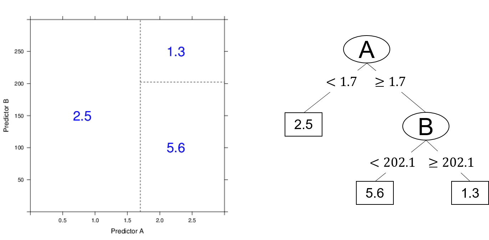

# Non-linear Algorithms {#non-lin-algs}

We now focus our attention to non-linear machine learning algorithms. As we learn about these algorithms you should notice that many of these are an extension of the linear algorithms we learned in Chapter \@ref(lin-algs).  

## Classification and Regression Trees (CART)

Our first algorithm we will examine is the CART algorithm. This algoritm is important as it forms the basis for ensemble algorithms such as Random Forests and Bagged Decision Trees which we will learn in Chaper \@ref(ens-algs). CART models are also used for both regression and classification problems. 

### What are CART models? {-}

CART models are simply decision trees. That is to say, the CART algorithm searches for points in the data to split the data into rectangular sections that increase the prediction accuracy. The more splits that are made within the data produces smaller and smaller segments up until a designated stopping point to prevent overfitting. A simple example will illustate the intuition behind CART.  Figure \@ref(fig:cart-example) demonstrates a simple CART model. Reviewing this output we can see the definition of the model being

```
if Predictor A >= 1.7 then
   if Predictor B >= 202.1 the Outcome = 1.3
   else Outcome = 5.6
else Outcome = 2.5
```

```{r cart-example, echo=FALSE,fig.asp=.7, fig.width=6, fig.cap='Example output and decision tree model adapted from Kuhn and Johnson (2013).', fig.align='center', out.width='90%'}

```

Using the above decision algorithm, we can make future predictions based of the split values of Predictor A and B. 

### How does a CART model learn from data? {-}

#### Regression Trees {-}

For regresdsion trees CART models search through all the data points for each predictor to determine the optimal split point that partitions the data into two groups and the sum of squred errors (SSE) is the lowest possible value for that split. In the previous example, that value was 1.7 for Predictor A. From that first split, the method is repeated within each new region until the model reaches a designated stopping point, for instance $n < 20$ data points in any new region. 

$$
SSE\ =\ \sum_{i\in S_1}^{ }\left(y_i-\overline{y_1}\right)^2\ +\ \sum_{i\in S_2}^{ }\left(y_i-\overline{y_2}\right)^2
$$

#### Classification Trees {-}

A frequently used measure for classification trees is the GINI index and is computed by

$$
G\ =\ \sum_{k=1}^np_k\times\left(1-p_k\right)
$$

where $p_k$ is the classification probability of the $k$th class. Using a process similar to the regression method, the algorithms searches for the best split point based on the lowest Gini index indicating the purest node for that split. In this case, purity refers to a node having more of one particular class than another. 

### Pre-processing requirements? {-}

### Practical Exerecise

## Naive Bayes

### Practical Exerecise

## k-Nearest Neigbors

### Practical Exerecise

## Support Vector Machines

### Practical Exerecise


