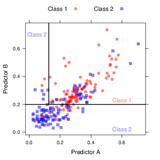
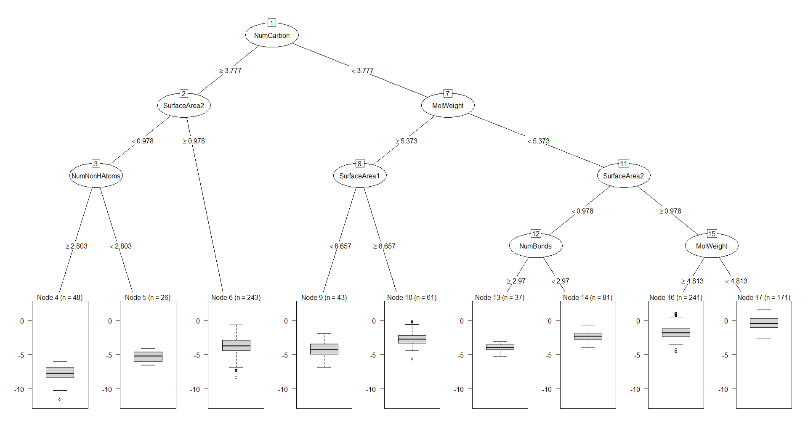
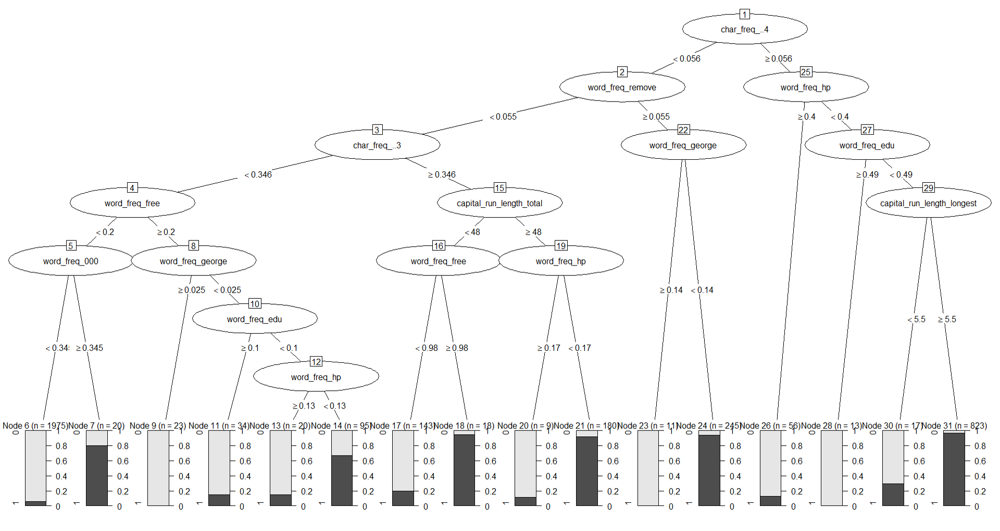
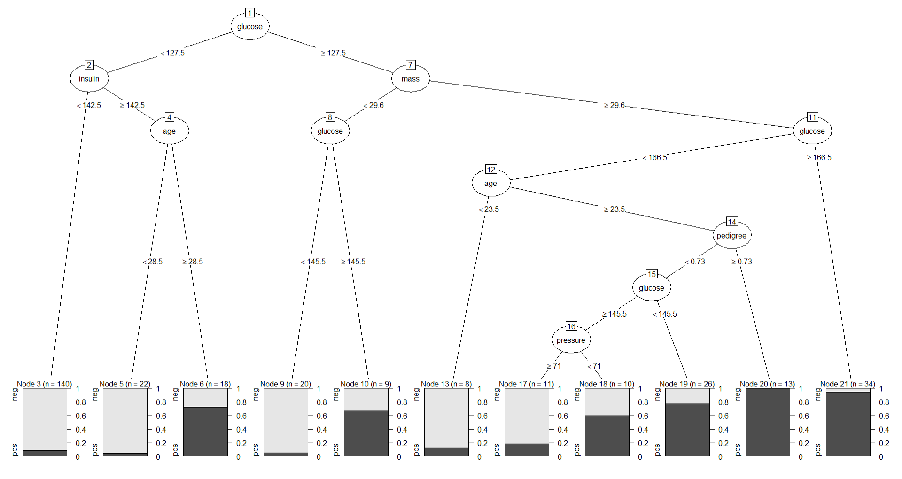
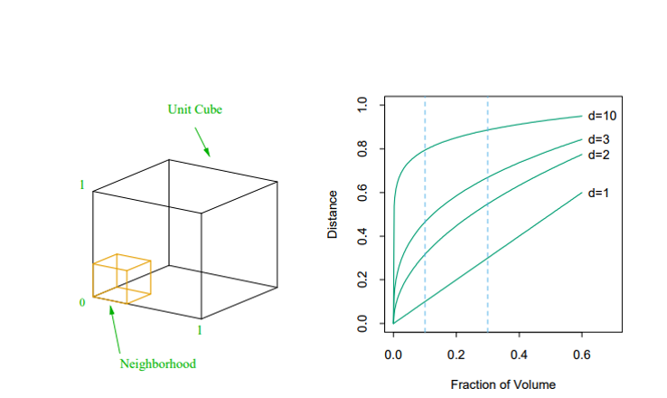
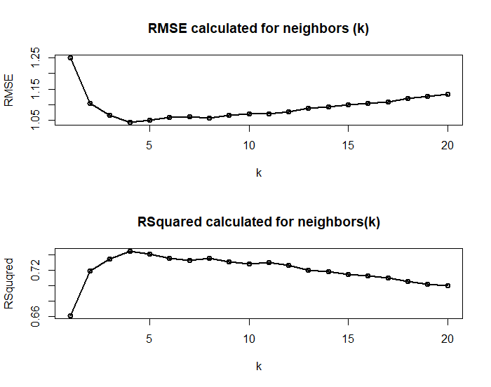
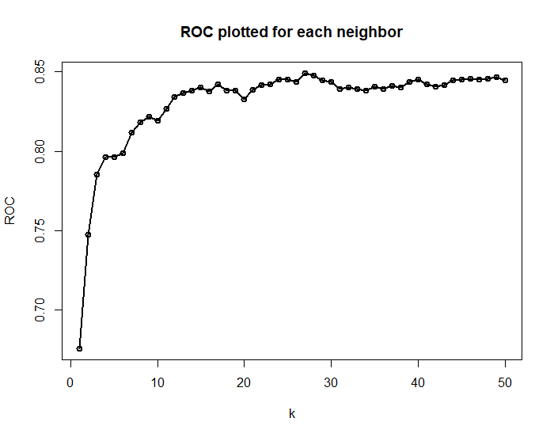

# Non-linear Algorithms {#non-lin-algs}

We now focus our attention on non-linear machine learning algorithms. As we learn about these algorithms, you should notice that many of these are an extension of the linear algorithms we learned in Chapter \@ref(lin-algs).  

## Classification and Regression Trees (CART)

The first algorithm we will examine is the CART algorithm. This algorithm is crucial as it forms the basis for ensemble algorithms such as Random Forests and Bagged Decision Trees which we will learn in Chapter \@ref(ens-algs). CART models are also used for both regression and classification problems. 

### What are CART models? {-}

CART models are simply decision trees. That is to say; the CART algorithm searches for points in the data to split the data into rectangular sections that increase the prediction accuracy. The more splits that are made within the data produces smaller and smaller segments up to a designated stopping point to prevent overfitting. A simple example will illustrate the intuition behind the CART algorithm.  Figure \@ref(fig:cart-example) demonstrates a simple CART model. Reviewing this output, we can see the definition of the model being

```
if Predictor A >= 1.7 then
   if Predictor B >= 202.1 the Outcome = 1.3
   else Outcome = 5.6
else Outcome = 2.5
```

```{r cart-example, echo=FALSE,fig.asp=.7, fig.width=6, fig.cap='Example output and decision tree model adapted from Kuhn and Johnson (2013).', fig.align='center', out.width='90%'}
knitr::include_graphics('img/cart-example.png')
```

Using the above decision algorithm, we can make future predictions based on the split values of Predictor A and B. 

### How does a CART model learn from data? {-}

#### Regression Trees {-}

For regression trees, CART models search through all the data points for each predictor to determine the optimal split point that partitions the data into two groups and the sum of squared errors (SSE) is the lowest possible value for that split. In the previous example, that value was 1.7 for Predictor A. From that first split; the method is repeated within each new region until the model reaches a designated stopping point, for instance, $n < 20$ data points in any new region. 


\[
SSE\ =\ \sum_{i\in S_1}^{ }\left(y_i-\overline{y_1}\right)^2\ +\ \sum_{i\in S_2}^{ }\left(y_i-\overline{y_2}\right)^2
\]


#### Classification Trees {-}

A frequently used measure for classification trees is the GINI index and is computed by

\[
G\ =\ \sum_{k=1}^Kp_k\times\left(1-p_k\right)
\]

where $p_k$ is the classification probability of the $k$th class. The optimal split point search process is similar to the regression method, except now the algorithm searches for the best split point based on the lowest Gini index indicating the purest node for that split. In this case, purity refers to a node having more of one particular class than another. 

#### Two-class Example {-}
To illustrate how to compute the Gini index, we will walk through a simple two-class example. The first step is to sort the sample based on the predictor values and then find the midpoint of the optimal split point. This split would create a contingency table like the one below. For this table, $n_{11}$ is the proportion of sample observations that are in group 1(samples that are greater than the split value) class 1. The same logic follows for the other three split values. The bold-faced values are the sub-totals of the split groups and the classifications. 


                        Class1                      Class2
--------------  -----------------------  -----------------------  ---------------------------
$>$ split          $n_{11}$               $n_{12}$                 $\mathbf{n_{>split}}$ 
$\leq$ split       $n_{21}$               $n_{22}$                 $\mathbf{n_{\leq split}}$
                 $\mathbf{n_{class1}}$    $\mathbf{n_{class2}}$    $\mathbf{n}$
---------------------------------------------------------------------------------------------

Before the split, the initial Gini index is 

\[G = 2\left(\frac{n_{class1}}{n}\right)\left(\frac{n_{class2}}{n}\right)\]. 

After the split, the Gini index changes to

\[
\begin{align}
G &=\ 2\left[\left(\frac{n_{11}}{n_{>split}}\right)\left(\frac{n_{12}}{n_{>split}}\right)\left(\frac{n_{>split}}{n}\right)\ +\ \left(\frac{n_{21}}{n_{\leq split}}\right)\left(\frac{n_{22}}{n_{\leq split}}\right)\left(\frac{n_{\leq split}}{n}\right)\right]\\
&=\ 2\left[\left(\frac{n_{11}}{n}\right)\left(\frac{n_{12}}{n_{>split}}\right)\ +\ \left(\frac{n_{21}}{n}\right)\left(\frac{n_{22}}{n_{\leq split}}\right)\right]
\end{align}
\]

We can see from the above equation that the Gini index now depends upon the proportion of samples of each class within a region that is weighted by the proportion of sample points in each split group. We compare the new Gini index value to the previous value of the Gini index.  If the new value is smaller than the previous value, the model makes the split the proposed split otherwise. 

Another frequently used method is the Information (Entropy) index and is calculated by

\[
I =\ \sum_{k=1}^{K}-p_klog_2\left(p_k\right)
\]

Similar to the Gini index for K = 2 classes, the information before a split is

\[
I(\text{before split}) = -\left[\frac{n_{class1}}{n}\ \times log_2\left(\frac{n_{class1}}{n}\right)\right]\ - \left[\frac{n_{class2}}{n}\ \times log_2\left(\frac{n_{class2}}{n}\right)\right]
\]

To determine how well a split improved the model, we will compute the information gain statistic. An increase in gain is an advantage, and a decrease in gain is a disadvantage. The calculation of gain is

\[
gain(\text{split}) =\ I(\text{before split})\ -\ I(\text{after split})
\]

To calculate the information index after the split, do the following

\[
\begin{align}
I(>split) &=\ -\left[\frac{n_{11}}{n_{>split}}\ \times\ log_2\left(\frac{n_{11}}{n_{>split}}\right)\right]\ - \left[\frac{n_{12}}{n_{>split}}\ \times\ log_2\left(\frac{n_{12}}{n_{>split}}\right)\right]\\
I(\leq split) &=\ -\left[\frac{n_{21}}{n_{\leq split}}\ \times\ log_2\left(\frac{n_{21}}{n_{\leq split}}\right)\right]\ - \left[\frac{n_{22}}{n_{\leq split}}\ \times\ log_2\left(\frac{n_{22}}{n_{\leq split}}\right)\right]\\ 
I(\text{after split}) &=\ \frac{n_{>split}}{n}\ I(>split)\ +\ \frac{n_{\leq split}}{n}\ I(\leq split)
\end{align}
\]

##### Gini Example {-}
We will now work through an example problem using the Gini index. Figure \@ref(fig:gini-example) shows the results of predicted classes with regions for a two-class model. There are a total of 208 observations: 111 observations for Class 1 and 97 observations for Class 2. Using this information, we can compute the Gini index before any splits.

```{r,gini-before}
n_obs <- 208
n_class_one <- 111
n_class_two <- 97
gini_before <- 2 * (n_class_one/n_obs) * (n_class_two/n_obs)
```

Based on the above calculation the pre-split Gini index is `r round(gini_before,3)`. 

```{r gini-example, echo=FALSE,fig.asp=.7, fig.width=6, fig.cap='Example classification model results.', fig.align='center', out.width='90%'}

```


The contingency table for Predictor B of the above figure is below. Using this information, we can compute the post-split Gini index 

                  Class1     Class2
--------------  ---------- ----------
$B > 0.197$         91         30
$B \leq 0.197$      20         67
-------------------------------------

```{r,gini-after}
n11 <- 91; n12 <- 30; n21 <- 20; n22 <- 67;
n_group_one <- 121; n_group_two <- 87;
group_one_prop <- (n11/n_obs)*(n12/n_group_one)
group_two_prop <- (n21/n_obs)*(n22/n_group_two)
gini_after <- 2 * sum(group_one_prop,group_two_prop)
```

The final Gini index post-split is now `r round(gini_after,3)` which indicates an improvement in classification purity. We can also observe that any value $\leq 0.197$ will receive a classification of 2 and a classification of 1 otherwise with regards to this particular split point. 

### Pre-processing requirements? {-}

CART models do not require any special pre-processing of the data, but you can center and scale values based on skewness and other factors.

### Practical Exerecise

#### Libraries{-}
This exercise will use the ``AppliedPredictiveModeling``, ``rpart``, ``caret``, and ``partykit`` packages.

```{r,cart-pe, message=FALSE, warning=FALSE}
library(AppliedPredictiveModeling)
library(rpart)
library(caret)
library(partykit)
library(mlbench)
library(kernlab)
```

#### Regression Tree {-}

##### Data {-}
For this exercise, we will use the solubility dataset described in @kuhn2013applied. In short, the features of this dataset are:

* 208 binary "fingerprints" that indicate the presence or absence of a particular chemical sub-structure; 
* 16 count descriptors (such as the number of bonds or the number of Bromine atoms);
* 4 continuous descriptors (such as molecular weight or surface area) [@kuhn2014package]. 

The authors centered and scaled the data to account for skewness. The target variable is a vector of log10 solubility values. The goal of this exercise is to predict the solubility value based on the set of features. Below is a view of some of the features and target values

```{r,cart-pe-data}
data(solubility)
str(solTrainXtrans[,c(1:10,209:228)])
str(solTrainY)
```

##### Create and Analyze Regression Tree {-}

The ``rpart()`` function in `R` is a widely used method for computing trees using the CART method, and we will use this function. Another package ``party`` uses the [conditional inference framework](https://stats.stackexchange.com/questions/12140/conditional-inference-trees-vs-traditional-decision-trees) to form its trees.

```{r,cart-tree-calc}
set.seed(100)
rpartTune <- train(solTrainXtrans, solTrainY,
                   method = "rpart2",
                   tuneLength = 10,
                   trControl= trainControl(method = "cv")
                   )
rpartTune$results

#Build the initial model

training_data <- data.frame(cbind(solTrainXtrans,solTrainY))
training_model <- rpart(solTrainY ~., data = training_data,
                    control = rpart.control(maxdepth = 10))

#Examine the tree complexity
plotcp(training_model)

training_model$cptable

#Add min(xerror+xstd) and find the smallest tree w/xerror < min(xerror+xstd)
which(training_model$cptable[,4] < min(training_model$cptable[,4]+training_model$cptable[,5]))

#Prune the tree
training_model <- rpart(solTrainY ~., data = training_data,
                    cp = .014)
model_tree <- as.party
```

Figure \@ref(fig:cart-plot) displays the final results that we can use for interpretation of the model. To create the plot just use the code ``plot(model_tree)``. You could also use the ``prp`` function from the ``rpart.plot`` package. Using that package the ``prp`` plot would be 

``prp(training_model,type=4,extra=106,box.col = c("#deebf7","#fff7bc")[training_model$frame$yval],cex = 0.6)``

```{r cart-plot, echo=FALSE,fig.asp=.7, fig.width=6, fig.cap='Final CART model regression results.', fig.align='center', out.width='90%'}

```

#### Classification Tree {-}

For this exercise, we will use the ``PimaIndianDiabetes2`` data from the ``mlbench`` package based on the dataset from the [UCI Machine Learning Repository](https://archive.ics.uci.edu/ml/datasets/pima+indians+diabetes). Click the link for a description of the dataset. In this exercise, we will build a classification tree that will classify a person as "pos" or "neg" for diabetes from a set of input features based on personal characteristics. 

##### Data {-}

I already created a training and test dataset from the original data. There are some missing values, so we will only use the complete cases for this example since the algorithms won't work with missing data. 

```{r,cart-pima}
pima_train <- read.csv("data/pima-train.csv",header=TRUE)
pima_train <- pima_train[complete.cases(pima_train),]
str(pima_train)
```

##### Create and Analyze Classification Tree {-}

```{r,cart-class}

#Gini Index
set.seed(33)
train_ctrl <- trainControl(method = "repeatedcv", number = 10, repeats = 3)
gini_tune <- train(as.factor(diabetes) ~., data = pima_train, method = "rpart",
                   trControl=train_ctrl,
                   tuneLength = 10, 
                   parms=list(split='gini'))
gini_tune

pima_gini_model <- rpart(as.factor(diabetes) ~., data = pima_train,
                    cp = .004)
pima_gini_tree <- as.party(pima_gini_model)

#Information Index
set.seed(33)
info_tune <- train(as.factor(diabetes) ~., data = pima_train, method = "rpart",
                   trControl=train_ctrl,
                   tuneLength = 10, 
                   parms=list(split='information'))
info_tune

pima_info_model <- rpart(as.factor(diabetes)~., data = pima_train,
                         cp = .004)
pima_info_tree <- as.party(pima_info_model)
```

 

```{r cart-gini-plot, echo=FALSE,fig.asp=.7, fig.width=6, fig.cap='Gini Index CART model classification results.', fig.align='center', out.width='90%'}

```

```{r cart-info-plot, echo=FALSE,fig.asp=.7, fig.width=6, fig.cap='Information Index CART model classification results.', fig.align='center', out.width='90%'}

```

## Naive Bayes

Recall Baye's Theorem from Chapter \@ref(lin-algs)

\[
\Pr\left(Y\ =\ k\ |X\right)\ =\ \frac{P\left(X|Y\ =\ k\right)P\left(Y\right)}{P\left(X\right)}
\]

where we want to answer the question "what is the probability of a particular target classification given the observed features?"

Upon calculating the posterior probability for each classification, you can then select the classification with the highest probability. In the literature, this calculation is the maximum a posteriori (MAP), and we find it by

\[
\begin{align}
MAP(Y) &=\ max\left(P(Y \vert X\right)\\
&=\ max\left(\frac{P\left(X|Y\ =\ k\right)P\left(Y\right)}{P\left(X\right)}\right)\\
&=\ max\left(P\left(X|Y\ =\ k\right)P\left(Y\right)\right)
\end{align}
\]

We can ignore the denominator of the original equation because the $P(X)$ is a constant for terms. Also, the reason why this method is called Naive Bayes is that the features are assumed to be independent. To put it another way, instead of computing $P(x_1,x_2,\dots,x_p\ \vert Y)$, the independence assumption simplifies this calculation to
 
\[
P\left(X\vert Y\ =\ k\right) = \prod_{j=1}^{P}P\left(X \vert Y\ = k\right)
\]

Another aspect of the Naive Bayes method is the distribution of the features. A Gaussian distribution will be used for continuous features, and kern density estimates for discrete features. 

### Practical Exerecise

We will use the Pima data for this exercise.

#### Naive Bayes Model {-}
We will use the ``naiveBayes`` function from the ``klaR`` package along with the ``caret`` package. 

```{r,naive-bayes,message=FALSE,warning=FALSE}
set.seed(33)
library(klaR)
nb_tune <- train(as.factor(diabetes) ~ ., 
         data=pima_train,
         method = "nb",
         trControl = trainControl(method="none"),
         tuneGrid = data.frame(fL=0, usekernel=FALSE, adjust=1))
nb_preds <- predict(nb_tune,pima_train,type = "raw")
confusionMatrix(nb_preds,as.factor(pima_train$diabetes))
```

## k-Nearest Neigbors

The basic idea of the $k$-nearest neighbors (KNN) algorithm is to create a distance matrix of the all the feature variables and choose the $k$ most adjacent data points closest to an evaluated point. Since KNN uses the entire dataset, no learning is necessary from the algorithm. The primary choice of the modeler is what decision metric to use. The primary parameter used is a variation of the Minkowski distance metric. You can compute this metric by

\[
\left(\sum_{i=1}^{P}\vert x_{ai} - x_{bi} \vert^q\right)^\frac{1}{q}
\]

where $\mathbf{x_a}$ and $\mathbf{x_b}$ are two sample points in the dataset. When $q\ =\ 1$ this distance metric is the Manhattan (city-block) distance, and when $q\ =\ 2$ this distance is the Euclidean distance. You will use Euclidean distance for continuous predictors and Manhattan distance for categorical or binary predictors. 

### Curse of Dimensionality {-}

Just like other machine learning methods the KNN method has its disadvantages. One disadvantage deals with high dimensional data. In essence, distances in higher dimensions are larger which ultimately mean that similar points are not necessarily local to each other. Figure \@ref(fig:knn-curse) demonstrates this problem. The figure on the left shows a unit hypercube with a sub-cube that captures a fraction of the data of the original hypercube. The sub-figure on the right shows how much of the range of each coordinate you need to capture within the sub-cube. For instance, if you want to capture 10% of the data, you will need to capture 80% of the range of coordinates for a 10-dimension dataset. This percentage increases exponentially with additional dimensions. 

```{r knn-curse, echo=FALSE,fig.asp=.7, fig.width=6, fig.cap='Illustration of dimensionality curse adapted from Hastie, Tibshirani, and Friedman (2009.', fig.align='center', out.width='90%'}

```

### Practical Exerecise

#### Regression {-}

##### Data {-}
We will use the solubility data for this exercise.

```{r,knn-data}
knn_data <- solTrainXtrans[,-nearZeroVar(solTrainXtrans)]
```

##### Create the model {-}
```{r,knn-reg, cache=TRUE}
set.seed(100)
knn_reg_model <- train(knn_data,
                       solTrainY,
                       method = "knn",
                       #Center and scaling will occur for new predictors
                       preProc = c("center", "scale"),
                       tuneGrid = data.frame(.k = 1:20),
                       trControl = trainControl(method = "cv")
                       )
knn_reg_model$finalModel
```

The final model selected was a model based on a value of $k\ =\ 4$. Figure \@ref(fig:knn-reg-plot) shows graphically why this model was the best of the 20 analyzed. 

```{r knn-reg-plot, echo=FALSE,fig.asp=.7, fig.width=6, fig.cap='Plots of RMSE and RSquared for values of k.', fig.align='center', out.width='90%'}

```

#### Classification {-}
We will again use the Pima data.

```{r, knn-class}
set.seed(202)
pima_knn <- train(as.factor(diabetes)~.,
                  data = pima_train,
                  method = "knn",
                  metric = "ROC",
                  preProc = c("center", "scale"),
                  tuneGrid = data.frame(.k=1:50),
                  trControl = trainControl(method = "cv",
                                           classProbs = TRUE,
                                           summaryFunction = twoClassSummary))
pima_knn
pima_knn$finalModel
```


The final model was computed from a total of $k\ =\ 27$ neighbors and a comparison of the ROC metric for each neighbor is shown in Figure \@ref(fig:knn-class-plot).

```{r knn-class-plot, echo=FALSE,fig.asp=.7, fig.width=6, fig.cap='Receiver-Operator Characteristic (ROC) curve results.', fig.align='center', out.width='90%'}

```

#### Exercise {-}
Create a new KNN model using only three predictor variables for the Pima data and compare those results to the current KNN model. Use the plot from the regression tree as a guide to determine which variables to choose. 

## Support Vector Machines

Support vector machines (SVM) started as a method for classification, but has extensions for regression as well. The goal of using SVM is to compute a regression line or decision boundary. 

### Regression {-}

For regression, the SVM seeks to minimize the cost function

\[
Cost\sum_{i=1}^nL_\epsilon \left(y_i - \hat{y_i}\right)\ +\ \sum_{j=1}^{P}\beta_{j}^2 
\]

where $Cost$ is the residual cost penalty and $L_\epsilon (\cdot)$ is the margin threshold.

Furthermore, we transform the prediction equation for $\hat{y}$ to

\[
\begin{align}
\hat{y} &=\ \beta_0\ +\ \beta_1u_1\ +\ \dots\ +\ \beta_pu_p\\
&=\ \beta_0\ +\ \sum_{j=1}^{P}\beta_ju_j\\
&=\ \beta_0\ +\ \sum_{j=1}^{P}\sum_{i=1}^{n}\alpha_ix_{ij}u_j\\
&=\ \beta_0\ +\ \sum_{i=1}^{n}\alpha_i\left(\sum_{j=1}^{P}x_{ij}u_j\right)
\end{align}
\]

where $\alpha_i$ is an unkown parameter estimated by the SVM algorithm. We can generalize the above equation for $\hat{y}$ even further to matrix form with

\[
f(u) = \beta_0\ +\ \sum_{i=1}^{n}\alpha_iK\left(x_i,\mathbf{u}\right)
\]

where $K\left(\cdot\right)$ is a kernel function. For SVM, there are a few models to choose for the kernel function to encompass linear and nonlinear functions of the predictors. The most common kernel functions are

\[
\begin{align}
\text{linear} &=\ x_i^{T}\mathbf{u}\\
\text{polynomial} &=\ \left(\phi(x^T\mathbf{u})\ +\ 1\right)^{degree}\\
\text{radial basis function} &=\ e^{\left(-\sigma\vert\vert x\ -\ \mathbf{u} \vert\vert^2\right)}\\
\text{hyperbolic tangent} &=\ tanh\left(\phi(x^T\mathbf{u})\ +\ 1\right)
\end{align}
\]


To demonstrate why you would use SVM for some regression situations, examine Figure \@ref(fig:svm-regress) below. The top of the figure shows a comparison of a simple linear regression model using least squares and SVM. The item to notice in this plot is the outlier at the top left of the plot. You will notice that the least squares model is more sensitive to this value, while SVM is not. The middle plot shows the relationship of the residuals to the predictive values. What is important to note with this plot is that the grey points are values that contributed to the regression line estimation, which the values shown by the red crosses did not contribute. This is because these non-contributing values are within the $\pm\ \epsilon\ =\ 0.01$ threshold set by the modeler. We explain why this happens in a little bit. The bottom plot shows a nonlinear application of SVM to a sine wave model. Again, there are outlier values in the bottom left of the plot and the least squqres method is more sensitive to these values than SVM. The reason for this is because least squares and other regression models like logistic regression are more global in their behavior, while SVM uses more local contributions from the data for its estimations. 

```{r svm-regress, echo=FALSE,fig.asp=.7, fig.width=6, fig.cap='Example SVM regressions compared to least squares adapted from Kuhn and Johnson (2013)', fig.align='center', out.width='90%'}
knitr::include_graphics('img/applied-pred-Ch7Fig07.png')
```


As we stated previously, the samples that contribute to the calcluation of the regression curve, also called suppprt vectors, are the samples  outside of the $\epsilon$ threshold. At first, this finding may seem counterintutive, so examining Figure \@ref(fig:svm-res-models) could help with building an intuition for this. Specifically looking at the bottom right model, we can see that the residuals that are within the $\epsilon$ threshold are in fact zero and all other residuals contribute linearly to the regression equation.  

```{r svm-res-models, echo=FALSE,fig.asp=.7, fig.width=6, fig.cap='Plots of various contributions to the regression line of model residuals adapted from Kuhn and Johnson (2013)', fig.align='center', out.width='90%'}
knitr::include_graphics('img/applied-pred-Ch7Fig06.png')
```

### Classification {-}

For the classification version of SVM, we want to compute an optimal decision boundary between seperable and non-seperable classes or categories. Figure \@ref(fig:svm-example) shows how SVM attempts to solve this problem. On the left, you will notice two seperable classes with infinite classification boundaries. On the right, is how SVM solves this problem. Specifically a boundary called the maximum margin classifier is computed. What's special about this boundary is that the boundary itself(solid black line) has margins that are set to the closets points for each class. The result of this is that now, unlike the regression model, samples that are closest to the boundary contribute to the classification model and those that are furtheest away from the boundary do not contribute at all. The equations for the classification version of SVM are similar to the regression equations. 

The general decision boundary equation is 

\[
D(u) = \beta_0\ +\ \sum_{i=1}^{n}y_i\alpha_iK(x_i,\mathbf{u})
\]

The key thing to notice is how the classification equation now includes the actual class of $y_i$ which is usally a value of -1 or 1. 

The kernel functions are

\[
\begin{align}
\text{linear} &=\ x_i^{T}\mathbf{u}\\
\text{polynomial} &=\ \left(scale(x^T\mathbf{u})\ +\ 1\right)^{degree}\\
\text{radial basis function} &=\ e^{\left(-\sigma\vert\vert x\ -\ \mathbf{u} \vert\vert^2\right)}\\
\text{hyperbolic tangent} &=\ tanh\left(scale(x^T\mathbf{u})\ +\ 1\right)
\end{align}
\]
\]

```{r svm-example, echo=FALSE,fig.asp=.7, fig.width=6, fig.cap='Datasets with separable classes adapted from Kuhn and Johnson (2013)', fig.align='center', out.width='90%'}
knitr::include_graphics('img/applied-pred-Ch13Fig09.png')
```

### Optimizaton Forumulation {-}

Ultimately, both the regression and classification equations are reformulated into a quadratic programming problem. While it is beyond the scope of this lesson to detail this formulation, the reader should review @friedman2001elements, specifically the section discussing SVMs. What's key to understanding this formulation is that the tuning of the SVM depends primarily on the cost parameter when estimating other parameters.  

### Practical Exerecise

#### Regression {-}

##### Data {-}
We will use the solubility data for this portion.

##### Model {-}

```{r, svrm-regress, cache=TRUE}
set.seed(33)
solubility_svm <- train(solTrainXtrans, solTrainY,
                        method = "svmRadial",
                        preProc = c("center", "scale"),
                        tuneLength = 14,
                        trControl = trainControl(method = "cv"))
solubility_svm
solubility_svm$finalModel
```

#### Classification {-}

##### Data {-}

We will us the Pima dataset

##### Model {-}

```{r, svm-class}
set.seed(202)
sigmaRange <- sigest(as.factor(diabetes) ~.,data=pima_train)
svmGrid <- expand.grid(.sigma = sigmaRange[1],
                       .C = 2^(seq(-4,4))) 
set.seed(386)
pima_svm <- train(as.factor(diabetes)~.,
                  data = pima_train,
                  method = "svmRadial",
                  metric = "ROC",
                  preProc = c("center","scale"),
                  tuneGrid = svmGrid,
                  fit = FALSE,
                  trControl = trainControl(method = "cv",
                                           classProbs = TRUE,
                                           summaryFunction = twoClassSummary))
pima_svm
pima_svm$finalModel
```


