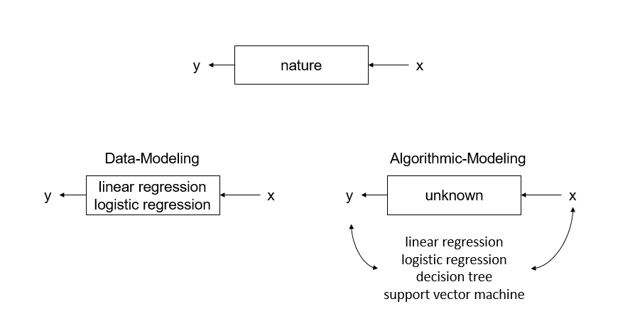

# Machine Learning Overview

## What is machine Learning?

In simple terms, machine learning is a statistical modeling technique that focuses on algorithmic-driven models instead of data-driven models. [Dr. Leo Breiman](https://projecteuclid.org/euclid.ss/1009213726) (2001), shows a comparison of these two approaches in the figure below.

The model at the top shows the original problem to be solved? That problem is how to best represent the relationsip between a vector in input variables $x$ and a corresponding response variable $y$. 

## What machine learning is not

## What do I need to know to get started with machine learning?

### The role of data in machine learning

### How do machine learning algorithms work?

### The difference between parametric and nonparametric machine learning algorithms

### The difference between supervised, unsupervised and semi-supervised learning

### The bias-variance tradeoff

### Overfitting and underfitting and what to do about it

