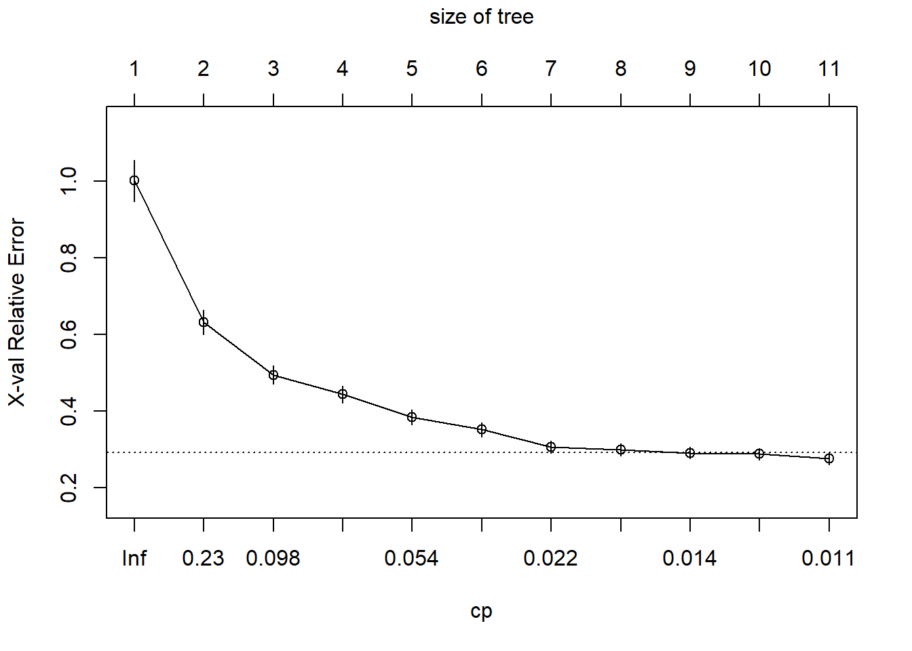

# Non-linear Algorithms {#non-lin-algs}

We now focus our attention on non-linear machine learning algorithms. As we learn about these algorithms, you should notice that many of these are an extension of the linear algorithms we learned in Chapter \@ref(lin-algs).  

## Classification and Regression Trees (CART)

The first algorithm we will examine is the CART algorithm. This algorithm is crucial as it forms the basis for ensemble algorithms such as Random Forests and Bagged Decision Trees which we will learn in Chapter \@ref(ens-algs). CART models are also used for both regression and classification problems. 

### What are CART models? {-}

CART models are simply decision trees. That is to say; the CART algorithm searches for points in the data to split the data into rectangular sections that increase the prediction accuracy. The more splits that are made within the data produces smaller and smaller segments up to a designated stopping point to prevent overfitting. A simple example will illustrate the intuition behind the CART algorithm.  Figure \@ref(fig:cart-example) demonstrates a simple CART model. Reviewing this output, we can see the definition of the model being

```
if Predictor A >= 1.7 then
   if Predictor B >= 202.1 the Outcome = 1.3
   else Outcome = 5.6
else Outcome = 2.5
```

<div class="figure" style="text-align: center">

<p class="caption">(\#fig:cart-example)Example output and decision tree model adapted from Kuhn and Johnson (2013).</p>
</div>

Using the above decision algorithm, we can make future predictions based on the split values of Predictor A and B. 

### How does a CART model learn from data? {-}

#### Regression Trees {-}

For regression trees, CART models search through all the data points for each predictor to determine the optimal split point that partitions the data into two groups and the sum of squared errors (SSE) is the lowest possible value for that split. In the previous example, that value was 1.7 for Predictor A. From that first split; the method is repeated within each new region until the model reaches a designated stopping point, for instance, $n < 20$ data points in any new region. 


\[
SSE\ =\ \sum_{i\in S_1}^{ }\left(y_i-\overline{y_1}\right)^2\ +\ \sum_{i\in S_2}^{ }\left(y_i-\overline{y_2}\right)^2
\]


#### Classification Trees {-}

A frequently used measure for classification trees is the GINI index and is computed by

\[
G\ =\ \sum_{k=1}^Kp_k\times\left(1-p_k\right)
\]

where $p_k$ is the classification probability of the $k$th class. The optimal split point search process is similar to the regression method, except now the algorithm searches for the best split point based on the lowest Gini index indicating the purest node for that split. In this case, purity refers to a node having more of one particular class than another. 

#### Two-class Example {-}
To illustrate how to compute the Gini index, we will walk through a simple two-class example. The first step is to sort the sample based on the predictor values and then find the midpoint of the optimal split point. This split would create a contingency table like the one below. For this table, $n_{11}$ is the proportion of sample observations that are in group 1(samples that are greater than the split value) class 1. The same logic follows for the other three split values. The bold-faced values are the sub-totals of the split groups and the classifications. 


                        Class1                      Class2
--------------  -----------------------  -----------------------  ---------------------------
$>$ split          $n_{11}$               $n_{12}$                 $\mathbf{n_{>split}}$ 
$\leq$ split       $n_{21}$               $n_{22}$                 $\mathbf{n_{\leq split}}$
                 $\mathbf{n_{class1}}$    $\mathbf{n_{class2}}$    $\mathbf{n}$
---------------------------------------------------------------------------------------------

Before the split, the initial Gini index is 

\[G = 2\left(\frac{n_{class1}}{n}\right)\left(\frac{n_{class2}}{n}\right)\]. 

After the split, the Gini index changes to

\[
\begin{align}
G &=\ 2\left[\left(\frac{n_{11}}{n_{>split}}\right)\left(\frac{n_{12}}{n_{>split}}\right)\left(\frac{n_{>split}}{n}\right)\ +\ \left(\frac{n_{21}}{n_{\leq split}}\right)\left(\frac{n_{22}}{n_{\leq split}}\right)\left(\frac{n_{\leq split}}{n}\right)\right]\\
&=\ 2\left[\left(\frac{n_{11}}{n}\right)\left(\frac{n_{12}}{n_{>split}}\right)\ +\ \left(\frac{n_{21}}{n}\right)\left(\frac{n_{22}}{n_{\leq split}}\right)\right]
\end{align}
\]

We can see from the above equation that the Gini index now depends upon the proportion of samples of each class within a region that is weighted by the proportion of sample points in each split group. We compare the new Gini index value to the previous value of the Gini index.  If the new value is smaller than the previous value, the model makes the split the proposed split otherwise. 

Another frequently used method is the Information (Entropy) index and is calculated by

\[
I =\ \sum_{k=1}^{K}-p_klog_2\left(p_k\right)
\]

Similar to the Gini index for K = 2 classes, the information before a split is

\[
I(\text{before split}) = -\left[\frac{n_{class1}}{n}\ \times log_2\left(\frac{n_{class1}}{n}\right)\right]\ - \left[\frac{n_{class2}}{n}\ \times log_2\left(\frac{n_{class2}}{n}\right)\right]
\]

To determine how well a split improved the model, we will compute the information gain statistic. An increase in gain is an advantage, and a decrease in gain is a disadvantage. The calculation of gain is

\[
gain(\text{split}) =\ I(\text{before split})\ -\ I(\text{after split})
\]

To calculate the information index after the split, do the following

\[
\begin{align}
I(>split) &=\ -\left[\frac{n_{11}}{n_{>split}}\ \times\ log_2\left(\frac{n_{11}}{n_{>split}}\right)\right]\ - \left[\frac{n_{12}}{n_{>split}}\ \times\ log_2\left(\frac{n_{12}}{n_{>split}}\right)\right]\\
I(\leq split) &=\ -\left[\frac{n_{21}}{n_{\leq split}}\ \times\ log_2\left(\frac{n_{21}}{n_{\leq split}}\right)\right]\ - \left[\frac{n_{22}}{n_{\leq split}}\ \times\ log_2\left(\frac{n_{22}}{n_{\leq split}}\right)\right]\\ 
I(\text{after split}) &=\ \frac{n_{>split}}{n}\ I(>split)\ +\ \frac{n_{\leq split}}{n}\ I(\leq split)
\end{align}
\]

##### Gini Example {-}
We will now work through an example problem using the Gini index. Figure \@ref(fig:gini-example) shows the results of predicted classes with regions for a two-class model. There are a total of 208 observations: 111 observations for Class 1 and 97 observations for Class 2. Using this information, we can compute the Gini index before any splits.


```r
n_obs <- 208
n_class_one <- 111
n_class_two <- 97
gini_before <- 2 * (n_class_one/n_obs) * (n_class_two/n_obs)
```

Based on the above calculation the pre-split Gini index is 0.498. 

<div class="figure" style="text-align: center">

<p class="caption">(\#fig:gini-example)Example classification model results.</p>
</div>


The contingency table for Predictor B of the above figure is below. Using this information, we can compute the post-split Gini index 

                  Class1     Class2
--------------  ---------- ----------
$B > 0.197$         91         30
$B \leq 0.197$      20         67
-------------------------------------


```r
n11 <- 91; n12 <- 30; n21 <- 20; n22 <- 67;
n_group_one <- 121; n_group_two <- 87;
group_one_prop <- (n11/n_obs)*(n12/n_group_one)
group_two_prop <- (n21/n_obs)*(n22/n_group_two)
gini_after <- 2 * sum(group_one_prop,group_two_prop)
```

The final Gini index post-split is now 0.365 which indicates an improvement in classification purity. We can also observe that any value $\leq 0.197$ will receive a classification of 2 and a classification of 1 otherwise with regards to this particular split point. 

### Pre-processing requirements? {-}

CART models do not require any special pre-processing of the data, but you can center and scale values based on skewness and other factors.

### Practical Exerecise

#### Libraries{-}
This exercise will use the ``AppliedPredictiveModeling``, ``rpart``, ``caret``, and ``partykit`` packages.


```r
library(AppliedPredictiveModeling)
library(rpart)
library(caret)
library(partykit)
```

#### Regression Tree {-}

##### Data {-}
For this exercise, we will use the solubility dataset described in @kuhn2013applied. In short, the features of this dataset are:

* 208 binary "fingerprints" that indicate the presence or absence of a particular chemical sub-structure; 
* 16 count descriptors (such as the number of bonds or the number of Bromine atoms);
* 4 continuous descriptors (such as molecular weight or surface area) [@kuhn2014package]. 

The authors centered and scaled the data to account for skewness. The target variable is a vector of log10 solubility values. The goal of this exercise is to predict the solubility value based on the set of features. Below is a view of some of the features and target values


```r
data(solubility)
str(solTrainXtrans[,c(1:10,209:228)])
```

```
## 'data.frame':	951 obs. of  30 variables:
##  $ FP001            : int  0 0 1 0 0 1 0 1 1 1 ...
##  $ FP002            : int  1 1 1 0 0 0 1 0 0 1 ...
##  $ FP003            : int  0 0 1 1 1 1 0 1 1 1 ...
##  $ FP004            : int  0 1 1 0 1 1 1 1 1 1 ...
##  $ FP005            : int  1 1 1 0 1 0 1 0 0 1 ...
##  $ FP006            : int  0 1 0 0 1 0 0 0 1 1 ...
##  $ FP007            : int  0 1 0 1 0 0 0 1 1 1 ...
##  $ FP008            : int  1 1 1 0 0 0 1 0 0 0 ...
##  $ FP009            : int  0 0 0 0 1 1 1 0 1 0 ...
##  $ FP010            : int  0 0 1 0 0 0 0 0 0 0 ...
##  $ MolWeight        : num  5.34 5.9 5.33 4.92 5.44 ...
##  $ NumAtoms         : num  3.37 3.91 3.53 3.3 3.47 ...
##  $ NumNonHAtoms     : num  2.83 3.3 2.77 2.4 2.77 ...
##  $ NumBonds         : num  3.43 3.97 3.53 3.3 3.47 ...
##  $ NumNonHBonds     : num  4.01 4.87 3.71 3.08 3.71 ...
##  $ NumMultBonds     : num  5.26 4.68 3.24 1.38 2.94 ...
##  $ NumRotBonds      : num  0 1.609 1.609 0.693 1.792 ...
##  $ NumDblBonds      : num  0 0 0.567 0.805 0 ...
##  $ NumAromaticBonds : num  2.83 2.56 1.95 0 1.95 ...
##  $ NumHydrogen      : num  3.86 5.32 4.73 4.47 4.47 ...
##  $ NumCarbon        : num  4.18 5.09 4.02 3.51 3.32 ...
##  $ NumNitrogen      : num  0.585 0.642 0 0 0.694 ...
##  $ NumOxygen        : num  0 0.693 1.099 0 0 ...
##  $ NumSulfer        : num  0 0.375 0 0 0 0.375 0 0 0 0 ...
##  $ NumChlorine      : num  0 0 0 0 0.375 ...
##  $ NumHalogen       : num  0 0 0 0 0.375 ...
##  $ NumRings         : num  1.386 1.609 0.693 0.693 0.693 ...
##  $ HydrophilicFactor: num  -1.607 -0.441 -0.385 -2.373 -0.071 ...
##  $ SurfaceArea1     : num  6.81 9.75 8.25 0 9.91 ...
##  $ SurfaceArea2     : num  6.81 12.03 8.25 0 9.91 ...
```

```r
str(solTrainY)
```

```
##  num [1:951] -3.97 -3.98 -3.99 -4 -4.06 -4.08 -4.08 -4.1 -4.1 -4.11 ...
```

##### Create and Analyze Regression Tree {-}

The ``rpart()`` function in `R` is a widely used method for computing trees using the CART method, and we will use this function. Another package ``party`` uses the [conditional inference framework](https://stats.stackexchange.com/questions/12140/conditional-inference-trees-vs-traditional-decision-trees) to form its trees.


```r
set.seed(100)
rpartTune <- train(solTrainXtrans, solTrainY,
                   method = "rpart2",
                   tuneLength = 10,
                   trControl= trainControl(method = "cv")
                   )
rpartTune$results
```

```
##    maxdepth     RMSE  Rsquared       MAE     RMSESD RsquaredSD      MAESD
## 1         1 1.617667 0.3745252 1.2657915 0.11511437 0.05777279 0.08191460
## 2         2 1.433114 0.5067404 1.1326186 0.07599686 0.04909341 0.04940391
## 3         3 1.357672 0.5568291 1.0657348 0.07354389 0.05231774 0.06091190
## 4         4 1.263596 0.6166997 0.9974476 0.10201869 0.05547696 0.07947602
## 5         5 1.192831 0.6581800 0.9429124 0.11324197 0.05669830 0.08594278
## 6         6 1.142654 0.6853056 0.9009065 0.10585813 0.05990671 0.08607556
## 7         7 1.111858 0.7020728 0.8707216 0.10580483 0.06389863 0.08126706
## 8         8 1.094535 0.7110088 0.8545809 0.11400541 0.06474333 0.09512021
## 9         9 1.091880 0.7116190 0.8465921 0.11938842 0.06737339 0.10068304
## 10       10 1.068799 0.7236716 0.8232469 0.12842861 0.07102897 0.10641491
```

```r
#Build the initial model

training_data <- data.frame(cbind(solTrainXtrans,solTrainY))
training_model <- rpart(solTrainY ~., data = training_data,
                    control = rpart.control(maxdepth = 10))

#Examine the tree complexity
plotcp(training_model)
```



```r
training_model$cptable
```

```
##            CP nsplit rel error    xerror       xstd
## 1  0.37300506      0 1.0000000 1.0010223 0.05357024
## 2  0.13770014      1 0.6269949 0.6314019 0.03143820
## 3  0.06971510      2 0.4892948 0.4945930 0.02321245
## 4  0.06180269      3 0.4195797 0.4434574 0.02133679
## 5  0.04729111      4 0.3577770 0.3838988 0.01904376
## 6  0.02650301      5 0.3104859 0.3514391 0.01837681
## 7  0.01789274      6 0.2839829 0.3062709 0.01570413
## 8  0.01553523      7 0.2660901 0.2989517 0.01566820
## 9  0.01178134      8 0.2505549 0.2910022 0.01551438
## 10 0.01150195      9 0.2387736 0.2879867 0.01543448
## 11 0.01000000     10 0.2272716 0.2761810 0.01525549
```

```r
#Add min(xerror+xstd) and find the smallest tree w/xerror < min(xerror+xstd)
which(training_model$cptable[,4] < min(training_model$cptable[,4]+training_model$cptable[,5]))
```

```
##  9 10 11 
##  9 10 11
```

```r
#Prune the tree
training_model <- rpart(solTrainY ~., data = training_data,
                    cp = .014)
model_tree <- as.party
```

Figure \@ref(fig:cart-plot) displays the final results that we can use for interpretation of the model. To create the plot just use the code ``plot(model_tree)``. You could also use the ``prp`` function from the ``rpart.plot`` package. Using that package the ``prp`` plot would be 

``prp(training_model,type=4,extra=106,box.col = c("#deebf7","#fff7bc")[training_model$frame$yval],cex = 0.6)``

<div class="figure" style="text-align: center">

<p class="caption">(\#fig:cart-plot)Final CART model regression results.</p>
</div>

#### Classification Tree {-}

For this exercise, we will use the ``spam`` data from the [UCI Machine Learning Repository](https://archive.ics.uci.edu/ml/datasets/spambase). Click the link for a description of the dataset. In this exercise, we will build a classification tree that will classify an email as "spam" (1) or "not spam" (0) from a set of input features based on characteristics of the email. 

##### Data {-}

I already created a training and test dataset from the original data.


```r
spam_train <- read.table("data/spam-train.txt",header=TRUE)
str(spam_train[,c(1:10,49:58)])
```

```
## 'data.frame':	3682 obs. of  20 variables:
##  $ word_freq_make            : num  0 0.21 0.06 0 0 0.06 0 0 0 0 ...
##  $ word_freq_address         : num  0.64 0.28 0 0 0 0.12 0 0.69 0 0.42 ...
##  $ word_freq_all             : num  0.64 0.5 0.71 0 0 0.77 0 0.34 0 0.42 ...
##  $ word_freq_3d              : num  0 0 0 0 0 0 0 0 0 0 ...
##  $ word_freq_our             : num  0.32 0.14 1.23 0.63 1.88 0.19 0 0.34 0.9 1.27 ...
##  $ word_freq_over            : num  0 0.28 0.19 0 0 0.32 0 0 0 0 ...
##  $ word_freq_remove          : num  0 0.21 0.19 0.31 0 0.38 0.96 0 0.9 0.42 ...
##  $ word_freq_internet        : num  0 0.07 0.12 0.63 1.88 0 0 0 0 0 ...
##  $ word_freq_order           : num  0 0 0.64 0.31 0 0.06 0 0 0 0 ...
##  $ word_freq_mail            : num  0 0.94 0.25 0.63 0 0 1.92 0 0.9 1.27 ...
##  $ char_freq_.               : num  0 0 0.01 0 0 0.04 0 0 0 0 ...
##  $ char_freq_..1             : num  0 0.132 0.143 0.135 0.206 0.03 0 0.056 0 0.063 ...
##  $ char_freq_..2             : num  0 0 0 0 0 0 0 0 0 0 ...
##  $ char_freq_..3             : num  0.778 0.372 0.276 0.135 0 0.244 0.462 0.786 0 0.572 ...
##  $ char_freq_..4             : num  0 0.18 0.184 0 0 0.081 0 0 0 0.063 ...
##  $ char_freq_..5             : num  0 0.048 0.01 0 0 0 0 0 0 0 ...
##  $ capital_run_length_average: num  3.76 5.11 9.82 3.54 2.45 ...
##  $ capital_run_length_longest: int  61 101 485 40 11 43 6 61 7 55 ...
##  $ capital_run_length_total  : int  278 1028 2259 191 49 749 21 261 25 249 ...
##  $ spam                      : int  1 1 1 1 1 1 1 1 1 1 ...
```

##### Create and Analyze Classification Tree {-}


```r
#Gini Index
set.seed(33)
train_ctrl <- trainControl(method = "repeatedcv", number = 10, repeats = 3)
gini_tune <- train(as.factor(spam) ~., data = spam_train, method = "rpart",
                   trControl=train_ctrl,
                   tuneLength = 10, 
                   parms=list(split='gini'))
gini_tune
```

```
## CART 
## 
## 3682 samples
##   57 predictor
##    2 classes: '0', '1' 
## 
## No pre-processing
## Resampling: Cross-Validated (10 fold, repeated 3 times) 
## Summary of sample sizes: 3314, 3314, 3314, 3314, 3314, 3314, ... 
## Resampling results across tuning parameters:
## 
##   cp           Accuracy   Kappa    
##   0.003445899  0.9081141  0.8058190
##   0.004824259  0.9076590  0.8046889
##   0.004996554  0.9075684  0.8043431
##   0.007580979  0.9004158  0.7877333
##   0.008959338  0.8977900  0.7824209
##   0.011026878  0.8948019  0.7760678
##   0.028945555  0.8835744  0.7519631
##   0.048587181  0.8580420  0.6960586
##   0.139214335  0.8024604  0.5694978
##   0.480358374  0.6672850  0.1807224
## 
## Accuracy was used to select the optimal model using the largest value.
## The final value used for the model was cp = 0.003445899.
```

```r
spam_gini_model <- rpart(as.factor(spam) ~., data = spam_train,
                    cp = .004)
spam_gini_tree <- as.party(spam_gini_model)

#Information Index
set.seed(33)
info_tune <- train(as.factor(spam) ~., data = spam_train, method = "rpart",
                   trControl=train_ctrl,
                   tuneLength = 10, 
                   parms=list(split='information'))
info_tune
```

```
## CART 
## 
## 3682 samples
##   57 predictor
##    2 classes: '0', '1' 
## 
## No pre-processing
## Resampling: Cross-Validated (10 fold, repeated 3 times) 
## Summary of sample sizes: 3314, 3314, 3314, 3314, 3314, 3314, ... 
## Resampling results across tuning parameters:
## 
##   cp           Accuracy   Kappa    
##   0.003445899  0.9094686  0.8089887
##   0.004824259  0.9047612  0.7987113
##   0.004996554  0.9044890  0.7981798
##   0.007580979  0.8992381  0.7872833
##   0.008959338  0.8960683  0.7809151
##   0.011026878  0.8947100  0.7783906
##   0.028945555  0.8750641  0.7335340
##   0.048587181  0.8527014  0.6836963
##   0.139214335  0.7885197  0.5351061
##   0.480358374  0.6613973  0.1634549
## 
## Accuracy was used to select the optimal model using the largest value.
## The final value used for the model was cp = 0.003445899.
```

```r
spam_info_model <- rpart(as.factor(spam)~., data = spam_train,
                         cp = .004)
spam_info_tree <- as.party(spam_info_model)
```

 

<div class="figure" style="text-align: center">

<p class="caption">(\#fig:cart-gini-plot)Gini Index CART model classification results.</p>
</div>

<div class="figure" style="text-align: center">

<p class="caption">(\#fig:cart-info-plot)Information Index CART model classification results.</p>
</div>

## Naive Bayes

Recall Baye's Theorem from Chapter \@ref(lin-algs)

\[
\Pr\left(Y\ =\ k\ |X\right)\ =\ \frac{P\left(X|Y\ =\ k\right)P\left(Y\right)}{P\left(X\right)}
\]

where we want to answer the question "what is the probability of a particular target classification given the observed features?"

Upon calculating the posterior probability for each classification, you can then select the classification with the highest probability. In the literature, this calculation is the maximum a posteriori (MAP), and we find it by

\[
\begin{align}
MAP(Y) &=\ max\left(P(Y \vert X\right)\\
&=\ max\left(\frac{P\left(X|Y\ =\ k\right)P\left(Y\right)}{P\left(X\right)}\right)\\
&=\ max\left(P\left(X|Y\ =\ k\right)P\left(Y\right)\right)
\end{align}
\]

We can ignore the denominator of the original equation because the $P(X)$ is a constant for terms. Also, the reason why this method is called Naive Bayes is that the features are assumed to be independent. To put it another way, instead of computing $P(x_1,x_2,\dots,x_p\ \vert Y)$, the independence assumption simplifies this calculation to
 
\[
P\left(X\vert Y\ =\ k\right) = \prod_{j=1}^{P}P\left(X \vert Y\ = k\right)
\]

Another aspect of the Naive Bayes method is the distribution of the features. A Gaussian distribution will be used for continuous features, and kern density estimates for discrete features. 

### Practical Exerecise

We will use the spam data for this exercise.

#### Naive Bayes Model {-}
We will use the ``naiveBayes`` function from the ``klaR`` package along with the ``caret`` package. 


```r
set.seed(33)
library(klaR)
nb_tune <- train(as.factor(spam) ~ ., 
         data=spam_train,
         method = "nb",
         trControl = trainControl(method="none"),
         tuneGrid = data.frame(fL=0, usekernel=FALSE, adjust=1))
nb_preds <- predict(nb_tune,spam_train,type = "raw")
confusionMatrix(nb_preds,as.factor(spam_train$spam))
```

```
## Confusion Matrix and Statistics
## 
##           Reference
## Prediction    0    1
##          0 1233   87
##          1  998 1364
##                                         
##                Accuracy : 0.7053        
##                  95% CI : (0.6903, 0.72)
##     No Information Rate : 0.6059        
##     P-Value [Acc > NIR] : < 2.2e-16     
##                                         
##                   Kappa : 0.444         
##  Mcnemar's Test P-Value : < 2.2e-16     
##                                         
##             Sensitivity : 0.5527        
##             Specificity : 0.9400        
##          Pos Pred Value : 0.9341        
##          Neg Pred Value : 0.5775        
##              Prevalence : 0.6059        
##          Detection Rate : 0.3349        
##    Detection Prevalence : 0.3585        
##       Balanced Accuracy : 0.7464        
##                                         
##        'Positive' Class : 0             
## 
```

## k-Nearest Neigbors

### Practical Exerecise

## Support Vector Machines

### Practical Exerecise


