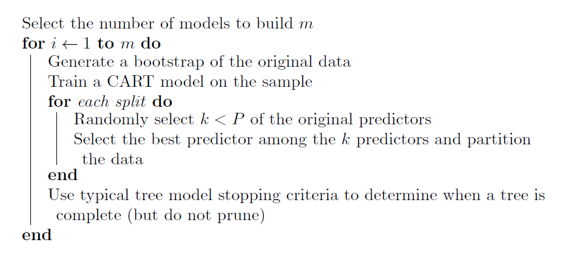

# Ensemble Algorithms {#ens-algs}

## Bagging

Bagging is short for Bootstrapped Aggregation. As you can guess from the name, the Bagging algorithm's basis is the [bootstrap](https://en.wikipedia.org/wiki/Bootstrapping_(statistics)). With bootstrapping, you can use resampling techniques to estimate an unknown parameter of the data. The bootstrap method computes this estimate by taking random samples, with replacement, of the data and calculating the estimated value a total of $B$ times. The final step is to calculate the average of the estimates over the $B$ bootstrap trials.  

With Bagging, the algorithm aggregates predictions from multiple machine learning models. Bagging provides an advantage for models that are high variance by reducing the variance of these models. In essence, Bagging mimics the phenomenon known as the ["wisdom of the crowd"](http://galton.org/search/essays/pages/galton-1907-vox-populi_1.png). In practice the algorithm is relatively simple

<div class="figure" style="text-align: center">

<p class="caption">(\#fig:bagging-algorithm)Bagging algorithm from Kuhn and Johnson (2013).</p>
</div>

Since Bagging works well on models with high variance, it is most widely used on CART models. Fundamentally, the Bagging algorithm cast votes on multiple trees that are individually weak learners. However, the aggregated response or classification has an overall reduced error rate without a loss in bias. 

### Practical Exercise {-}

For this and the remaining PEs in this chapter, we will use the same solubility and Pima datasets from Chapter \@ref(non-lin-algs).


```r
library(AppliedPredictiveModeling)
library(rpart)
library(caret)
library(partykit)
library(mlbench)
library(kernlab)
library(ipred)
library(randomForest)
library(gbm)
```


```r
data(solubility)
pima_train <- read.csv("data/pima-train.csv",header=TRUE)
pima_train <- pima_train[complete.cases(pima_train),]
```

#### Regression {-}


```r
set.seed(100)
train_control <- trainControl(method='cv', number=5, returnResamp='none')
bag_regress <- train(solTrainXtrans, solTrainY,
                   method = "treebag",
                   trControl= train_control
                   )
bag_regress$results
```

```
##   parameter      RMSE  Rsquared       MAE    RMSESD RsquaredSD      MAESD
## 1      none 0.9208562 0.8011265 0.7022581 0.0404631 0.03403587 0.03130357
```

#### Classification {-}


```r
set.seed(100)
bag_class <- train(as.factor(diabetes) ~., 
                   data = pima_train,
                   method = "treebag",
                   trControl= train_control
                   )
bag_class$results
```

```
##   parameter  Accuracy     Kappa AccuracySD    KappaSD
## 1      none 0.7715822 0.4847493 0.04241899 0.08441819
```

## Random Forest

While we can significantly reduce model variance with Bagging, it has some drawbacks. In particular, Bagging creates trees on the entire feature space for each sample. Thus, most trees, especially at the top layers will look very similar, and as a result, most of the trees are not independent of each other. The Random Forest algorithm fixes this problem. Reviewing the algorithm in Figure \@ref(fig:random-forest-algorithm), you will notice that instead of building a tree on the entire feature space, Random Forest trees are constructed using a random sample of $k < P$ of the original predictors. For classification, a general default for the number of predictors at each split point is $k\ =\ \sqrt{P}$. For regression, the default number of predictors at each split point is $k\ =\ \frac{P}{3}$. A side benefit of this algorithm is that Random Forest is more computationally efficient since trees are not built on the entire set of features. 

<div class="figure" style="text-align: center">

<p class="caption">(\#fig:random-forest-algorithm)Random Forest algorithm from Kuhn and Johnson (2013).</p>
</div>

### Practical Exercise {-}

#### Regresssion {-}


```r
set.seed(41)
rf_regress_model <- randomForest(solTrainXtrans,solTrainY,
                                 importance=TRUE,
                                 ntrees=500)
rf_regress_model
```

```
## 
## Call:
##  randomForest(x = solTrainXtrans, y = solTrainY, importance = TRUE,      ntrees = 500) 
##                Type of random forest: regression
##                      Number of trees: 500
## No. of variables tried at each split: 76
## 
##           Mean of squared residuals: 0.4222374
##                     % Var explained: 89.91
```

```r
head(rf_regress_model$importance)
```

```
##           %IncMSE IncNodePurity
## FP001 0.006445326      1.786854
## FP002 0.010880283      2.427839
## FP003 0.007691509      2.469004
## FP004 0.025182610     17.044367
## FP005 0.004678159      1.405516
## FP006 0.009439474      4.459932
```

```r
#We won't run this, but this is how you would train this model using CARET
# mtry_min <- floor(ncol(solTrainXtrans)/3)
# mtry_max <- ncol(solTrainXtrans)
# mtry <- seq(mtry_min,mtry_max)
# train_control <- trainControl(method='cv', number=5, search='grid')
# model_metric <- "RMSE"
# tune_grid <- expand.grid(.mtry=mtry)
# 
# rf_random_regress <- train(solTrainXtrans, solTrainY,
#                    method = "rf",
#                    trControl= train_control,
#                    metric = model_metric,
#                    tuneGrid = tune_grid
#                    )
```

#### Classification {-}


```r
#Random search
set.seed(41)
mtry_min <- floor(sqrt(ncol(pima_train)-1))
mtry_max <- ncol(pima_train)-1
mtry <- mtry_min
train_control <- trainControl(method='cv', number=5, search='random')
model_metric <- "Accuracy"
tune_grid <- expand.grid(.mtry=mtry)


rf_random_class <- train(as.factor(diabetes) ~., 
                   data = pima_train,
                   method = "rf",
                   trControl= train_control,
                   metric = model_metric
                   )
rf_random_class$results
```

```
##   mtry  Accuracy     Kappa AccuracySD    KappaSD
## 1    2 0.7908606 0.5230442 0.02152436 0.04163186
## 2    5 0.7909118 0.5159105 0.03077111 0.07472786
## 3    8 0.7814921 0.4994510 0.03575589 0.08559938
```

#### Exercise {-}
Retrin the Pima random forest model using a grid search for the ``mtry`` parameter. 

## AdaBoost

Similar to Bagging models, Boosting models create multiple learners; in particular, decision trees. Unlike Bagging models, however, Boosting models build an initial model, and then makes incremental improvements to the models at subsequent iterations. One of the most popular Boosting algorithms is the Adaboost algorithm. Figure \@ref(fig:adaboost-algorithm) shows the steps for the Adaboost algorithm. The first model starts by weighing each observation uniformly. Next, a classifier model is generated followed by a weighted error. From this error, a scaling parameter $\alpha_m$ is computed. After the computation of $\alpha_m$, the weights are updated. 

<div class="figure" style="text-align: center">

<p class="caption">(\#fig:adaboost-algorithm)Adaboost classification algorithm from Hastie, Tibshirani, and Friedman (2009).</p>
</div>

Before computing the weights, let's take a deeper dive into the $\alpha_m$ parameter. Figure \@ref(fig:adaboost-error) shows how $\alpha$ changes based on possible weighted error rates. In essence, observations that have a classification that agrees with the actual value receive a higher positive $\alpha_m$ value; observations that have a $50/50$ chance of being correct, receive a $\alpha_m$ value of zero; finally, observations that are misclassified have high negative values. 

<div class="figure" style="text-align: center">

<p class="caption">(\#fig:adaboost-error)Adaboost error rate.</p>
</div>

To compute the updated weights, the previous weight is multiplied by $e^{-\alpha_m y_i G_m(x_i)}$. Essentially, this exponential parameter will be larger for misclassified observations, and smaller for correctly classified observations. In effect, this will increase the weights for misclassified observations and reduce the weights for correctly classified observations at the next iteration. Lastly, the algorithm returns the sign of the final weighted sums. 

### Practical Exercise {-}


```r
set.seed(100)
gbm_grid <- expand.grid(n.trees=c(100, 500),
                         shrinkage=c(0.01, 0.001),
                         interaction.depth=c(1,5),
                         n.minobsinnode=10)
gbm_control <- trainControl(method='cv', 
                              number=5,
                              classProbs = TRUE,
                              summaryFunction = twoClassSummary
                              )
gbm_metric <- "ROC"
ada_class <- train(as.factor(diabetes) ~., 
                   data = pima_train,
                   method = "gbm",
                   distribution="adaboost",
                   verbose=FALSE,
                   trControl= gbm_control,
                   metric = gbm_metric,
                   tuneGrid = gbm_grid
                   )
ada_class$results
```

```
##   shrinkage interaction.depth n.minobsinnode n.trees       ROC      Sens
## 1     0.001                 1             10     100 0.8149485 1.0000000
## 5     0.010                 1             10     100 0.8367787 0.9706098
## 3     0.001                 5             10     100 0.8511670 1.0000000
## 7     0.010                 5             10     100 0.8529044 0.9313415
## 2     0.001                 1             10     500 0.8273662 1.0000000
## 6     0.010                 1             10     500 0.8465590 0.8819512
## 4     0.001                 5             10     500 0.8510762 0.9802439
## 8     0.010                 5             10     500 0.8445998 0.8576829
##        Spec      ROCSD     SensSD    SpecSD
## 1 0.0000000 0.08295399 0.00000000 0.0000000
## 5 0.3545455 0.06764300 0.01084269 0.1338181
## 3 0.0000000 0.07544806 0.00000000 0.0000000
## 7 0.5419913 0.08249568 0.02053167 0.1284063
## 2 0.0000000 0.07122291 0.00000000 0.0000000
## 6 0.5792208 0.07931748 0.05469074 0.1377872
## 4 0.2415584 0.07989993 0.02084617 0.1164474
## 8 0.6173160 0.07781126 0.05620946 0.1037314
```

## Gradient Boosting

Using a similar stagewise approach, Gradient Boosting (GBM) builds an ensemble of weak models, but improves the models by optimizing an arbitrary loss function. The loss functions are usally squared loss $\left(\frac{1}{2}\left[y_i\ -\ f(x_i)\right]^2\right)$, absolute loss $\left(\vert y_i\ -\ f(x_i) \vert\right)$, and the [Huber Loss](https://en.wikipedia.org/wiki/Huber_loss) function for regression. Classification models use the deviance loss. Figure \@ref(fig:gradient-boosting-regression) shows the GBM algorithm for regression and Figure \@ref(fig:gradient-boosting-classification) shows the GBM algorithm for classifiction. Both algorithms work in a similar manner. 

First, the model initiates an optimal single terminal node tree (also known as a stump). Next, the model computes a negative gradient, fits a new regression tree, and updates the predicted values of each sample with a learning parameter $\gamma$.  

<div class="figure" style="text-align: center">

<p class="caption">(\#fig:gradient-boosting-regression)Gradient Boosting regression algorithm from Hastie, Tibshirani, and Friedman (2009).</p>
</div>

<div class="figure" style="text-align: center">

<p class="caption">(\#fig:gradient-boosting-classification)Gradient Boosting classification algorithm from Hastie, Tibshirani, and Friedman (2009).</p>
</div>

### Practical Exercise {-}


```r
set.seed(100)
gbm_class <- train(as.factor(diabetes) ~., 
                   data = pima_train,
                   method = "gbm",
                   distribution="bernoulli",
                   verbose=FALSE,
                   trControl= gbm_control,
                   metric = gbm_metric,
                   tuneGrid = gbm_grid
                   )
gbm_class$results
```

```
##   shrinkage interaction.depth n.minobsinnode n.trees       ROC      Sens
## 1     0.001                 1             10     100 0.8122234 1.0000000
## 5     0.010                 1             10     100 0.8359652 0.9559756
## 3     0.001                 5             10     100 0.8504862 1.0000000
## 7     0.010                 5             10     100 0.8506037 0.9262195
## 2     0.001                 1             10     500 0.8278197 0.9901220
## 6     0.010                 1             10     500 0.8481866 0.8818293
## 4     0.001                 5             10     500 0.8508756 0.9753659
## 8     0.010                 5             10     500 0.8439658 0.8626829
##        Spec      ROCSD     SensSD     SpecSD
## 1 0.0000000 0.08469365 0.00000000 0.00000000
## 5 0.3831169 0.06891182 0.02026189 0.08287528
## 3 0.0000000 0.07402308 0.00000000 0.00000000
## 7 0.5515152 0.08046038 0.03112146 0.14110330
## 2 0.1861472 0.07441610 0.01352779 0.09213765
## 6 0.5796537 0.07909138 0.08513077 0.16192154
## 4 0.3536797 0.08044493 0.01768082 0.09446756
## 8 0.6545455 0.07375167 0.05362804 0.11110455
```

#### Exercise {-}
Adjust the tuning grid and determine if we can improve the boosting models.
